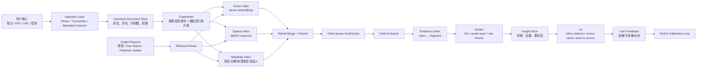
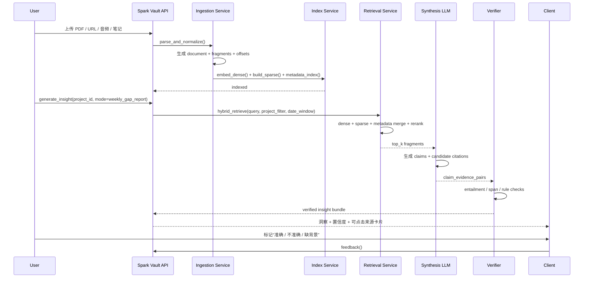

# Spark Vault 的可追溯证据链

## 执行摘要

这份报告基于你当前的产品方向：Spark Vault 不是一个泛化的“AI 聊天 / AI 日记”，而是一个把用户的实践笔记、外部参考资料与 AI 洞察链接起来的个人成长系统；你希望做到“**每条洞察都能追溯到来源**”。这一定位也与此前你上传的产品设计稿所体现的模块结构一致：已有 Library、AI Digest、Chat、Reports、Skills 等围绕“记录—分析—沉淀”的构件。fileciteturn0file0

核心结论先说在前面。

**第一，海外市场对“有来源、可核查”的 AI 输出确实有强需求，但需求更明确地集中在两大场景，而不是泛泛的 AI 日记。**  
一类是 **citation-first information tools**，即像 Perplexity、Consensus、Elicit 这样的“带来源的查询 / 研究 / 汇总”工具；另一类是 **personal knowledge / second-brain tools**，即 Notion AI、Reflect、Readwise、Logseq/Obsidian 这类“把资料、笔记、上下文串起来”的工具。前者证明用户愿意为“可验证”付费，后者证明用户愿意为“个人上下文”持续输入与订阅。相比之下，单纯的“AI 陪伴 / AI journaling”虽然有流量，但安全与信任风险更高。Character.AI 在公开研究中被指出拥有 **超过 2000 万 MAU**，但同时伴随未成年人安全、成瘾、人格依附和内容治理问题；这说明“陪伴 / 角色扮演”不是 Spark Vault 最优、也不是最稳的市场切口。citeturn15academia5turn0news1turn14academia4

**第二，技术上，“有引用”不等于“可信”。**  
现有研究已经说明，生成式搜索或带引用的 QA 系统，表面上看起来更可信，但底层经常并不够可核查：一项针对 Bing Chat、Perplexity 等系统的人工审计发现，**只有 51.5% 的生成句子被引用充分支持**，而且**只有 74.5% 的引用真正支持对应句子**；另一项研究发现，**只要给出引用，哪怕引用是随机的，也会显著提升用户信任**。这意味着 Spark Vault 不能只做“好看的 citation UI”，而必须做**claim-level evidence chain**：让每条主张都能跳转到具体片段、偏移位置、页码或音频时间戳，并让系统自己做二次验证。citeturn2academia2turn27academia2turn27academia4

**第三，你的方向是对的，但前提是产品必须收窄到“source-grounded reflection”而不是“AI personality / celebrity dialog / therapy-like companion”。**  
更准确地说，Spark Vault 最可行的海外切口是：  
**“把我学到的知识、我做过的实践、以及 AI 生成的洞察，变成一套可追溯、可核查、可修正的个人 playbook。”**  
这条路线同时切中了海外用户的三类现实痛点：  
一是他们愿意用 AI，但**不愿把不透明回答直接当事实**；KPMG 与墨尔本大学覆盖 47 国、48,340 人的研究显示，**66% 的工作使用者不会核查 AI 输出的准确性**，**56% 承认已经因为 AI 出过工作错误**。二是大规模用户反馈研究显示，AI 产品最常见的负面反馈集中在**技术失败、价格、以及语言 / 可靠性限制**。三是用户确实愿意为高价值知识工具订阅：Reflect 官方价格为 **10 美元 / 月**，Readwise 为 **9.99 美元 / 月**，Notion Business 含 AI 能力为 **20 美元 / 人 / 月**，Elicit 则形成了从免费到 **29–49 美元 / 人 / 月** 的研究型阶梯。citeturn26news0turn14academia12turn6view3turn17view0turn17view4turn21view1

**第四，MVP 不应该追求“做出更聪明的总结”，而应该追求“做出更可审计的洞察”。**  
建议 MVP 的技术目标不是“减少一点点幻觉”这种难以感知的底层目标，而是非常清晰的三个产品承诺：  
其一，**每条洞察都显示来源数量与来源类型**；  
其二，**每条洞察都能点回原文片段**；  
其三，**没有充分证据时系统明确 abstain，而不是补齐猜测**。  
在验证指标上，Spark Vault 应该从第一天就跟踪：claim-level citation precision、citation recall、unsupported-claim rate、evidence click-through、user accepted insight rate、以及 D7 / D30 retention。citeturn29view5turn29view6turn29view7turn2academia2

## 研究边界与核心判断

本报告默认以下现实约束：**规模、预算、云厂商均无特定限制**；因此推荐方案优先考虑“先做可信、再做便宜”，并在架构上保留从 API-first 迁移到混合自托管的空间。这个假设本身不是事实判断，而是为了给出工程上最稳的 MVP 路线。

如果把问题收束成一句话，Spark Vault 要解决的不是“怎么生成更像真人教练的回答”，而是：

**在个人成长和知识复盘场景里，怎么让 AI 洞察变成一段可以被用户回看、质疑、纠正、再利用的证据链。**

这件事有真实市场基础，但也有明确边界。

一方面，**source-grounded AI** 已经被海外用户验证为有付费意愿的价值点。Consensus 的官方定价页直接写明“**超过 500 万研究者、学生和临床人员信任 Consensus**”；Elicit 官方页面写明其搜索覆盖 **1.38 亿篇论文和 54.5 万项临床试验**，并在客户案例中给出 **99.4% 的数据抽取准确率**；Perplexity 虽然围绕版权和内容抓取一直存在争议，但其规模已经大到 Wired 在 2026 年报道中仍以**约 6000 万月活**来描述其订阅与企业化转型，这说明“带引用的答案”本身已形成用户习惯。citeturn21view0turn6view6turn6view7turn15news4

另一方面，**私域上下文与长期记忆** 也被证明是可持续价值。Reflect 明确把自己定位为“notes with an AI assistant”，强调 GPT-4、Whisper、第二大脑、E2E encryption，并公开以 **10 美元 / 月** 订阅；Readwise 则把“revisit and learn from highlights”做成稳定订阅产品，官方价格 **9.99 美元 / 月**，并大量展示用户把它视作长期学习工具的公开反馈；Logseq 在 GitHub 上有 **4.32 万 stars**，Obsidian 的 Smart Connections 插件有 **5100 stars**，显示“把个人笔记喂给 AI”的需求已经从边缘实验变成成熟社区能力。citeturn42view1turn42view0turn17view0turn17view2turn16view0turn17view6turn17view7

所以，**方向是对的，但必须收窄。**  
Spark Vault 不是要和 Character.AI 抢“陪伴时间”，也不是要和 Notion 抢“通用工作台”，而是要卡在两者之间：  
**“有证据的个人复盘 / personal evidence system”**。  
这也是你之前反复强调“不要心理化、不要玄学化、不要无依据分析”的正确方向。

## 海外市场需求与用户研究

### 需求存在，但最强信号来自相邻赛道而不是“AI 成长日记”本身

公开市场里，最强的量化需求并不来自“AI self-reflection app”这个窄标签，而是来自三个相邻、且高度相关的需求池。

第一是 **citation-first AI search / evidence tools**。Perplexity 已被 Wired 描述为约 **6000 万 MAU** 的产品，并且主动从广告转向更强调信任的订阅与企业路线；Consensus 官方则写明有 **500 万+** 用户；Elicit 官方提供从个人研究到系统综述的分层工作流，并把“看来源”“解释 AI 答案”“系统综述工作流”作为付费能力。这说明，海外用户并不只要“快答案”，他们也愿意为“**答案背后的可追溯证据**”买单。citeturn15news4turn21view0turn21view1

第二是 **AI-enhanced PKM / second brain**。Reflect 的卖点非常接近 Spark Vault 的一部分理想形态：AI assistant、chat with your notes、voice transcription、长期笔记网络、E2E encryption；Readwise 已经把“高亮—回顾—再利用”做成稳定订阅模型；Notion Business 版把 Agent、AI Meeting Notes、Enterprise Search、以及“已验证页面会在 AI citations 中显示 verified badge”直接打包给企业。这说明“**带上下文的 AI**”已经是用户可理解的购买对象。citeturn42view1turn17view2turn17view4turn5view0

第三是 **social / companion AI**。Character.AI 证明用户对“人格化 AI”存在极高需求，公开研究估计其 MAU 超过 **2000 万**；但它也同时证明，越接近陪伴、治疗、角色依恋，越会进入监管和事故高风险区。Character.AI 的大规模负面评论研究分析了 **210,840 条 Google Play 评论**，发现负反馈集中在**技术故障、版本变更带来的不稳定**，并且有一部分评论明确把问题表述为**成瘾或心理影响**。对 Spark Vault 来说，这意味着 celebrity-style dialog 或“AI mentor impersonation”虽然可能带来短期互动率，但和你要做的长期价值产品是相反方向。citeturn15academia5turn14academia4

### 客户最在意的不是“AI 会不会聪明”，而是“它能不能被我验证”

这点在多类研究里反复出现。

覆盖 47 国、48,340 人的 KPMG / 墨尔本大学全球研究显示，AI 已经深度进入工作流，但使用方式与信任校准严重失衡：**58% 的人会主动在工作中使用 AI**，**57% 承认会隐瞒自己的 AI 使用**，**66% 不会核查 AI 输出准确性**，**56% 已发生过 AI 导致的工作错误**。这组数据非常重要，因为它说明：  
用户不是没有使用意愿，恰恰相反，他们已经大量使用；  
真正缺的不是“再多一个 AI app”，而是**一个能让他们更安全地使用 AI 的证据界面**。citeturn26news0turn25news1

更细一点看，针对 292 个 AI 移动应用、**894K 条与 AI 功能相关评论**的大规模研究发现，正向反馈稳定集中在 **productivity、reliability、personalized assistance**；负向反馈则集中在 **technical failures、pricing concerns、language limitations**。这和 Spark Vault 完全相关：  
如果你做成“很会说但不可靠”，会死在 reliability；  
如果你做成“很重很慢很贵”，会死在 technical failure + pricing。  
所以国际市场要的不是“更像导师的语言风格”，而是“**更稳定、更有根据、更省验证成本**”。citeturn14academia12

### 海外用户已经为“高价值知识工具”建立了明确价格锚点

从公开价格看，这个市场不是没有 willingness-to-pay，问题只是**你能否把价值讲清楚**。

Reflect 的官方价格是 **10 美元 / 月（年付）**；Readwise 官方价格是 **9.99 美元 / 月（年付）**；Notion Business 版含 AI 为 **20 美元 / 人 / 月**，并把 Agent、AI Meeting Notes、Enterprise Search 打包进去；Elicit 则从免费延伸到 **7 美元 / 人 / 月（Plus 年付）**、**29–49 美元 / 人 / 月（Pro 档位，页面存在动态差异）**，并把系统综述、报告配额、API、可解释答案等作为上层付费能力。这个价格带说明：  
**消费级个人知识产品的可接受区间大致在 8–15 美元 / 月；高强度研究 / 专业工作流可到 20–50 美元 / 月。**  
Spark Vault 如果定位知识工作者 / 高自驱学习者，而不是大众“写日记”，是有价格空间的。citeturn6view3turn17view0turn17view4turn21view1

### 代表性用户声音显示：用户喜欢“上下文”和“来源”，但讨厌“猜测”和“隐私风险”

公开用户反馈中，最值得参考的不是夸“很聪明”，而是夸“有上下文”和“能回到资料”。

Consensus 的官方引述写得非常直白：它“**帮我找到真实、同行评审的来源；它不替我写，但它让我更有把握地写**”；另一位 PhD 候选人称其通过高亮最相关论文与研究设计，已经变成论文工作流的必需品。Reflect 的公开用户反馈里，有人称其为“**knowledge worker’s dream come true**”，另一位用户强调它“在后台做了大部分组织工作”。Readwise 的公开用户评价则反复强调“**每天把高亮重新送回来**”带来的长期学习价值。对 Spark Vault 来说，这些反馈共同指向一个事实：用户最愿意付费的，不是抽象的“更成长”，而是**可反复进入、可回看上下文、能真正减少认知负担**。citeturn21view0turn42view0turn17view2

负向反馈则主要来自两个方向。  
一类是 **错误但看起来可信**。Perplexity 在 Wired 的评测中被直接批评为能够“带来源地胡说”，这不是表述风格问题，而是 attribution 机制不足的问题。另一类是 **隐私与记录边界**。Rewind 在媒体评测中被描述成“privacy nightmare or amazing memory tool”，即便它强调本地存储，用户依然担心“记录一切”的法律与人身风险。Spark Vault 如果处理日志、录音、关系记录，一定要把**source traceability**和**privacy control**一起设计，而不是只设计前者。citeturn2news0turn18news0

### 对 Spark Vault 的市场判断

把上面所有证据合起来，比较客观的判断是：

**海外有需求，但不是对“AI 成长”四个字本身有需求；而是对“AI 帮我更可靠地处理我的资料与实践”有需求。**

因此，Spark Vault 当前方向**成立的前提**是：

- 主定位从 **AI journaling / AI companion** 改为 **source-grounded reflection system**；
- 主人群从“泛成长用户”缩到 **knowledge workers / graduate-level learners / reflective professionals**；
- 主价值从“更懂你”改成“**更有根据地指出知行差距，并沉淀成你的 playbook**”。

如果你反过来用“大师导师”“名人对话”“人格感很强的伴随式聊天”做核心卖点，那么你会进入更拥挤、更高监管风险，也更难建立信任的赛道。Character.AI 的规模确实证明“陪伴”有流量，但它同样证明那条路对你现在想做的产品是不合适的。citeturn15academia5turn36news2turn38view1

## 可追溯证据链技术方案

### 你真正要做的不是 citation，而是 provenance

Spark Vault 不能只实现“回答后面显示 [1][2][3]”。  
你要做的是 **provenance chain**，即从原始材料到最终洞察的完整链路：

**source document → normalized fragment → retrieval candidate → cited claim → verification result → UI jump-back**

这条链必须是数据层强约束，而不是前端附加装饰。因为已有研究说明，**仅仅展示 citation 会显著抬高用户信任，哪怕引用本身是错的或随机的**。所以系统需要的不只是“生成引用”，而是“**生成后验证引用是否真的支撑具体 claim**”。citeturn27academia2turn27academia4

### 推荐的最小可行架构

这个架构的关键不是复杂，而是坚持三条原则：

其一，**存两层 chunk**。  
粗粒度 chunk 用于检索，通常 250–500 token；细粒度 span 用于真正的引用跳转，最好是一到三句、一个段落，或 10–30 秒音频窗口。LlamaIndex 的 citation workflow 也明确采用“先检索，再把节点切成更细的 citation chunks”的做法，默认 citation chunk size 为 **512**、overlap **20**。citeturn28view0

其二，**混合检索而不是纯向量检索**。  
Haystack 文档明确同时支持 BM25、embedding 与 hybrid retriever；Qdrant 也把 hybrid query 作为标准能力，并直接指出文本搜索里“**dense + sparse** 能结合语义理解与精确词匹配的优点”。对于 Spark Vault 这种“日志 + 书摘 +网页 +录音转写”的场景，纯向量检索会漏掉专有名词、时间、人物、原句措辞；纯 BM25 又会漏掉语义近义。推荐默认使用 **dense + sparse + metadata filter** 的三路检索，然后 RRF 或 weighted merge，再做 rerank。citeturn44view4turn44view3turn29view4

其三，**claim-level verifier 必须独立于生成器**。  
也就是说，生成模型负责提出洞察和候选引用；验证模型或规则系统负责判断“这条 claim 是否真的被这些 span 支持”。如果验证不过，就降级成“Partial support”或直接要求模型重写 / abstain。这是因为 RAG 不能消除幻觉：法律 AI 工具的独立评测显示，即便采用 RAG，闭源法律工具仍有 **17%–33%** 的 hallucination rate；CRAG 基准进一步显示，即便是业界领先的 RAG 方案，也只有 **63%** 的问题能做到“正确且无幻觉”。citeturn2academia5turn46academia3

### 参考资料摄取与标准化

下表给出更适合 Spark Vault 的摄取层选型。

| 组件 | 可选方案 | 优点 | 缺点 | 更适合 Spark Vault 的建议 |
|---|---|---|---|---|
| PDF / Office / HTML 解析 | **Unstructured** | 覆盖 PDF、HTML、Word 等多格式，定位就是 LLM data preprocessing citeturn30view0 | 复杂版面精细度一般 | 适合通用入口 |
| PDF 高精解析 | **Marker** | 可快速输出 **Markdown + JSON**，支持表格、公式、图片、去页眉页脚，并能输出结构树与 bbox 信息 citeturn31view2turn31view4 | GPL-3.0；部署复杂度更高；GPU 更适配 | 用于高价值 PDF 与报告类资料 |
| 轻量 PDF 抽取 | **PyMuPDF** | 直接拿到 words / blocks / dict，可保留位置信息；`sort` 参数能改善阅读顺序 citeturn31view0turn31view1 | 需要自己处理布局、表格、标题层级 | 用于本地快速抽取与 source jump-back |
| 音频转写 | **WhisperX** | 提供 **word-level timestamps**，并通过 VAD + forced alignment 改善长音频漂移与幻觉，论文报告可达 **12x** 加速 citeturn32academia1 | 自部署较重 | 强烈推荐做音频引用偏移 |
| URL / 网页摄取 | **Unstructured + custom scraper** | 容易统一为文档对象 | 法律 / robots / paywall 风险 | 只抓用户主动收藏的页面，且只存必要片段 |

建议的文档标准化对象如下：

| 表 | 关键字段 | 说明 |
|---|---|---|
| `source_document` | `doc_id`, `user_id`, `project_id`, `type`, `source_url`, `created_at`, `license_flag`, `visibility`, `checksum` | 原始文档元数据与权限 |
| `source_fragment` | `fragment_id`, `doc_id`, `page_no`, `bbox`, `audio_start_ms`, `audio_end_ms`, `char_start`, `char_end`, `text`, `speaker`, `chunk_level`, `embedding_id` | 引用与检索的最小可追溯单元 |
| `retrieval_event` | `request_id`, `query`, `retriever`, `fragment_id`, `raw_score`, `rerank_score`, `metadata_filters` | 记录证据是怎么被找出来的 |
| `insight` | `insight_id`, `request_id`, `title`, `claim_text`, `insight_type`, `confidence_band`, `status` | 生成后的洞察对象 |
| `evidence_link` | `insight_id`, `claim_id`, `fragment_id`, `support_type`, `support_score`, `quote_excerpt`, `verified` | claim 与 fragment 的绑定关系 |
| `verification_run` | `run_id`, `claim_id`, `method`, `entailment_score`, `span_overlap_score`, `verdict`, `model_version` | 二次验证记录 |
| `playbook_rule` | `rule_id`, `project_id`, `statement`, `backing_insight_ids`, `last_confirmed_at`, `expiry_policy` | 最终沉淀的个人法则 |

### 检索、生成与验证的推荐流程

下面是更接近生产可落地的 API 序列。

其中最重要的四个工程决策是：

**检索层**  
默认采用 **hybrid retrieval**：dense embedding + BM25 + metadata filter；在项目内限定时间窗、文档类型和来源类型，避免“广义相关”稀释用户日志与参考资料之间的真实关系。Haystack 的文档也明确把 hybrid retrieval 描述为结合稀疏与稠密检索优势的典型策略。citeturn44view4turn44view2

**生成层**  
提示词必须显式要求：**仅基于提供材料回答、每条主张至少有一个来源、没有依据时要说不知道**。LlamaIndex 的 citation QA 模板已经非常接近这个要求，甚至明确写了“Only cite a source when you are explicitly referencing it”“If none of the sources are helpful, you should indicate that”。这类模板对 Spark Vault 应直接采用并二次强化。citeturn28view0

**验证层**  
至少做三种检查：  
一是 **span existence**，即引用的 fragment 是否真实存在；  
二是 **claim support**，可用 NLI / groundedness / faithfulness 做判定；  
三是 **quote containment**，洞察中的直接表述不能超出原片段语义边界。Ragas 已把 **Context Precision、Context Recall、Faithfulness、Response Groundedness** 等评估维度做成通用框架，适合接入持续评测。citeturn29view5turn29view6turn29view7

**状态层**  
不要只给一个总分。  
更好的做法是 claim-level 三段式：  
- **Confirmed**：至少两段独立证据支持，或一段强支撑 + 高 NLI；  
- **Partial**：只被一段边缘支持，或证据存在但语义跨度大；  
- **Weak / Needs review**：检索到了相关材料，但 verifier 不通过。  

这比“置信度 0.83”更可解释，也更符合用户理解。

### 向量检索与符号检索的取舍

Spark Vault 场景里，“向量 vs 符号”不是二选一，而是**不同层次解决不同问题**。

向量检索负责找“意思相近”的东西，例如日志里写“我又拖了”，文献里讲的是 procrastination、avoidance、delay discounting；  
符号检索负责找“精确命中”的东西，例如某个具体人名、具体会议、具体书摘、具体日期；  
metadata filter 负责做“边界控制”，例如只看某个项目、某一周、某类来源、某位说话人的录音。

如果你只做向量索引，最常见的失败不是“完全找不到”，而是“找到了看起来相关、其实不够可引用的材料”；  
如果你只做关键词检索，最常见的失败是“只按字面召回，抓不住跨表述的长期模式”。  
因此，**Spark Vault 的默认方案应该是 hybrid retrieval，而不是纯 vector DB demo**。Qdrant、Haystack 都已经把这一点产品化。citeturn29view4turn44view3

### 建议的 RAG 变体优先级

不是所有 RAG 变体都要一开始上。建议分层使用。

**MVP 必须有：基础 Hybrid RAG + Rerank + Claim Verifier**。  
这已经足以支撑你的核心承诺。

**第二阶段建议加入：CRAG 风格的 retrieval evaluator**。  
CRAG 的核心思想很适合 Spark Vault：先评估检索结果质量，再决定是直接生成、补充检索，还是拒答。对你的场景尤其有价值，因为“实践日志 + 参考资料”的匹配质量会高度不稳定。citeturn46academia0

**第三阶段可考虑：Self-RAG / selective retrieval**。  
Self-RAG 的重要价值不是“更像研究论文”，而是它证明了**模型可以在需要时才检索，并对自己的生成进行反思**，从而降低不必要的检索开销，同时提升 factuality 与 citation accuracy。对于周报、Playbook 更新等高频任务，这会明显影响成本和延迟。citeturn45academia0turn45academia3

**图谱化 / Graph-enhanced retrieval** 适合作为 Playbook 层，而不是初版主链路。  
因为你最终要沉淀的是“我在什么场景里、对什么原则、有什么验证结果”的结构化法则，这更像 **graph memory**，不适合一开始做重。

## 幻觉缓解与验证体系

### 先接受一个现实：RAG 不是“幻觉消除器”

很多产品文件会把“RAG = grounded = no hallucination”写成默认前提，这在今天已经站不住。

前面提到的生成式搜索可验证性审计显示，**只有 51.5% 的生成句子被引用完全支持**；法律 AI 工具的独立评测显示，RAG 化之后仍有 **17%–33%** 的 hallucination；更广泛的 CRAG 基准显示，SOTA 产业方案也只做到 **63% 无幻觉回答率**。从产品角度看，这意味着 Spark Vault 最需要避免的表述不是“偶尔会有错误”，而是**任何“hallucination-free / zero hallucination”的暗示**。citeturn2academia2turn2academia5turn46academia3

对外应该承诺的是：  
**“每条洞察都附带来源，并允许你追溯、核查与纠正。”**  
而不是：  
**“AI 不会胡说。”**

### 幻觉缓解建议采用“五层防线”

**输入层：只进入可信、必要、带边界的材料。**  
URL 只摄取用户主动收藏的页面；录音只处理用户明确授权的文件；对 PDF / 网页尽量只保留必要文本、元数据与偏移，而不是无界抓取。这样做既是安全，也是为了减少 retrieval noise。citeturn30view0turn18news0

**检索层：hybrid retrieval + rerank + filter。**  
把找材料变成系统化步骤，不让生成模型直接“凭印象召回”。

**生成层：citation-aware prompting + abstention。**  
要求回答基于 sources、每条主张带引用、无法支持就直接说证据不足。LlamaIndex 的模板可直接作为设计蓝本。citeturn28view0

**验证层：claim-evidence verification。**  
用独立 verifier 做 entailment / groundedness / quote-span 检查。  
这是 Spark Vault 的真正差异点。

**反馈层：人类在环与系统评测。**  
让用户很容易点“准确 / 不准确 / 断章取义 / 需要更多背景”；同时离线用 Ragas 或自建集合做持续评测。用户反馈不是客服功能，而是**证据链系统的一部分**。citeturn29view7

### 最关键的不是“让用户更信”，而是“让用户更会校准信任”

这里有一个容易被忽视但非常危险的点：  
**引用会抬高信任，哪怕它们是假的。**  
两篇研究都指出，只要有 citations / reference links，用户会显著更信任 GenAI；而当用户真的点开看、开始检查时，信任会下降。另一项大规模实验还发现，reference links 和 citations **即便错误或 hallucinated，也会提高用户信任**。这意味着 Spark Vault 的目标不能是“让洞察看起来更有学术感”，而必须是“**让验证动作足够低摩擦，促使用户真的去检查关键来源**”。citeturn27academia2turn27academia4

这直接决定 UI 设计原则：

- 不能把 citation 做成纯装饰；
- 不能把“来源已附上”当作“可信已成立”；
- 要把最关键的 1–3 条证据放在洞察同屏，而不是埋到二级页面；
- 对弱证据必须显式标“Needs review”。

### 推荐的验证指标体系

建议把 Spark Vault 的 QA 分成四组。

**归因质量**  
- **Citation precision**：被引用的 fragment 是否真的支持对应 claim  
- **Citation recall**：重要 claim 是否都附了证据  
- **Unsupported-claim rate**：输出中无支撑主张占比  

**检索质量**  
- **Context precision**  
- **Context recall**  
- **Rerank lift**：rerank 前后 verifier 通过率变化  

**生成质量**  
- **Faithfulness / groundedness**  
- **Abstention correctness**：证据不足时是否能拒答  
- **Overgeneralization rate**：从多个局部案例跳到全局人格判断的频率  

**用户信任与行为质量**  
- **Evidence click-through rate**：用户是否会点来源  
- **Accepted insight rate**：用户认为“有帮助且准确”的洞察比例  
- **Correction incorporation rate**：一次纠正后，后续相同模式是否改善  
- **Trust calibration delta**：用户自评信任与实际 verifier 结果之间的偏差变化  

Ragas 已经提供了 RAG 评估的通用指标基线，适合做离线与回归测试；线上则必须组建你自己的 human audit 集合，因为 Spark Vault 的关键任务不是百科 QA，而是“个人上下文中的行为洞察”。citeturn29view5turn29view6turn29view7

## 产品建议与优先级路线图

### 对 Spark Vault 最重要的产品建议

**建议一：把产品主叙事改成“evidence-backed reflection”，不要再让外界误以为这是 AI 心理陪伴或角色扮演产品。**  
公开监管在快速逼近：欧盟 AI Act 已明确要求聊天机器人让人知道正在和机器互动，并要求某些生成内容具备可识别性；加州 SB 243 已要求 companion chatbot 做清晰 disclosure，并增加未成年人安全报告义务；美国 NO FAKES Act 也在 2026 年 5 月再次提出，目标直指未经授权的数字替身、声音与形象。Spark Vault 如果主打“名人对话 skill / 大师导师风格化人格”，你会主动把自己推向更复杂的合规与内容风险区。citeturn37view0turn36news2turn38view1

**建议二：第一阶段不要做“名人 / 大师模拟对话”。**  
不仅是因为风险，也因为那不是你最有市场价值的差异点。  
真正的差异点是：  
**“我每周能看到哪些知识被我真正实践了，哪些只是收藏了。”**  
这个点海外比“AI 导师人格”更容易理解，也更容易持续付费。

**建议三：不要把“报告”做成总结，而要做成“知行差距报告 + 可回到证据的 playbook 更新”。**  
这是 Spark Vault 能区别于普通 AI notes / AI journaling 的地方。

### 建议的 MVP 功能集合

MVP 不要超过五个核心对象：

| MVP 功能 | 为什么优先 |
|---|---|
| **项目（Projects）** | 把“亲密关系、工作人际、管理学习、职业转型”变成有边界的长期主题容器 |
| **资料摄取（PDF / URL / note / audio）** | 构建证据的原材料池 |
| **Cited Insight** | 每条洞察显示来源数量、来源类型、可跳回片段 |
| **Weekly Practice Gap Report** | 对比“参考资料”与“实践记录”，生成知行差距 |
| **Playbook Rule Builder** | 把被多次证实的洞察沉淀成可更新原则 |

初版**不建议**做的功能：  
- 名人 / 大师角色对话  
- 开放社区 / social feed  
- 公开网页抓取与自动扩散式搜索  
- 高情感依附型伴随聊天  
这些功能会显著拉高法律、信任、审核与误用风险，但不会提升你的核心验证价值。

### 六个月优先级路线图

| 时间 | 目标 | 关键产出 | 验证指标 |
|---|---|---|---|
| **0–6 周** | 问题验证 | landing page、demo video、手工 concierge 报告服务 | waitlist 转化、访谈转化率、首批用户资料上传率 |
| **6–12 周** | MVP 内测 | Projects、资料摄取、hybrid retrieval、cited insight card、feedback | evidence click-through、accepted insight rate、unsupported-claim rate |
| **3–4 月** | 周报与知行差距 | weekly report、reference vs practice 对照、abstain 机制 | WAU、周回访率、report open rate、correction rate |
| **4–6 月** | playbook 沉淀 | rule builder、版本化法则、项目内时间轴 | D30 retention、付费转化、playbook creation rate |

### 建议的 A/B 实验

第一轮不是测 UI，而是测价值叙事。建议至少跑三个定位版本：

A. **Every insight links to evidence**  
B. **Find the gap between what you know and what you do**  
C. **Build your personal playbook from notes and practice**

观测指标不是点击率而已，而是：
- waitlist email conversion
- first upload completion
- first report generation completion
- 7 日内再次回来查看证据的比例
- 愿意付费预订 / 预约访谈比例

预计 B 和 A 的组合最有机会跑赢 C，因为海外用户先理解“gap”和“evidence”，再理解“playbook”。

### 建议追踪的核心 KPI

Spark Vault 不应该只看 MAU。更重要的是这些指标：

- **Evidence-backed insight rate**：生成洞察中通过 verifier 的比例  
- **Unsupported claim rate**：无支撑主张比例  
- **Evidence click-through rate**：用户点击来源的比例  
- **Insight acceptance rate**：用户标记为“准确 / 有帮助”的比例  
- **Correction resolution rate**：不准确洞察被修正后，后续同类错误是否下降  
- **Weekly active projects**：有复盘动作的项目数  
- **Notes-per-user-per-week** 与 **reference ingestion rate**：供给侧是否足够  
- **D7 / D30 retention**：是否形成周期性复盘习惯  
- **Paid conversion**：出现在首份高质量周报 / 第一条 playbook 规则之后的付费率

### 海外用户调研建议

建议第一批只招三类用户，每类 10–15 人，先做 30–45 人的定性研究。

**第一组：知识工作者**  
如 PM、设计师、市场、独立顾问、创业者。  
他们最可能理解“知行差距”和“项目化复盘”。

**第二组：高强度学习者 / 研究生 / 博士生**  
他们对引用、来源、证据链天然敏感，也更能容忍早期产品。

**第三组：重度 PKM 用户**  
Notion、Readwise、Reflect、Logseq、Obsidian 用户。  
他们已经形成资料输入习惯，是最容易迁移的人群。

建议访谈问题：

- 你最近一次觉得 AI 帮到你、但你又不太敢完全相信它，是什么场景？
- 你在自己的笔记、日志、录音、收藏里，最难“再找到”的是什么？
- 你有过“我明明知道这个道理，但我没有做到”的例子吗？
- 如果一份 AI 周报能指出你的一个行为模式，你最担心它哪里会说错？
- 你愿不愿意为“每条洞察都可追溯到来源”的工具付费？在什么前提下？
- 你希望系统展示“引用”到什么细粒度：页码、段落、时间戳，还是原句高亮？
- 对你来说，什么才算一条“值得保留下来的个人原则”？

## 风险、合规与开放问题

### 合规风险不是外围问题，而是产品边界问题

欧盟 AI Act 已明确：AI Act 是全球首个综合 AI 法框架；聊天机器人要让用户知道正在与机器互动；生成内容要可识别；deepfakes 与公共利益文本存在额外的标识义务；透明度规则将在 **2026 年 8 月** 生效。对 Spark Vault 来说，这意味着如果将来有任何“公开发布的 AI 生成内容”“AI 生成音视频”“名人风格人格模拟”，都要把 disclosure 当成产品架构的一部分，而不是法律补丁。citeturn37view0

美国方向也在收紧。NO FAKES Act 于 **2026 年 5 月 21 日** 又被重新提出，目的非常清楚：保护人的 voice 和 visual likeness 不被 AI 未经同意复制；同一份官方声明还引用 RIAA 的表述称，**92% 的美国人担心 AI deepfakes 对邻里与文化的影响**。这意味着如果 Spark Vault 做任何 celebrity-skill、voice clone、public-persona mentor，都要承担更高的权利与投诉风险。citeturn38view0turn38view1

加州 SB 243 已要求 companion chatbot 做清晰 disclosure，并引入自杀 / 自伤相关安全与报告要求；加州对训练数据透明度的要求也在 2026 年正式生效。虽然 Spark Vault 不是基础模型提供方，但如果你声称用用户日志训练定制模型，或在营销上模糊“AI 输出 / 人类建议”的边界，也会落入更敏感的监管视线。citeturn36news2turn34news1

### 引用与版权的具体注意点

你要做“traceable evidence”，不是做“内容搬运”。

因此产品层面应遵守这些原则：

- 对网页与出版内容，UI 中只显示**必要短摘录**、标题、来源名、原文入口与偏移位置，不大段复现全文。  
- 不绕过 robots / paywall 做系统性抓取；只处理用户主动导入内容，或经许可的数据源。Perplexity 近年的版权与抓取争议，本质上就是“有引用不等于有正当数据关系”。citeturn43news0turn2news0
- 对用户私有日志 / 录音，默认**私有、可撤回、可删除、可导出**；并在导入音频时明确提示可能涉及第三人隐私。
- 对 AI 生成的公开内容，明确标注 AI assistance / AI-generated summary，尤其面向欧盟用户时更要提前准备。

### 开放问题与局限

这份研究也有几个需要诚实说明的限制。

第一，**“AI reflection / AI personal playbook”这个精确标签的原生搜索量与 MAU 数据非常少**。公开可得的强证据主要来自相邻市场：citation-first search、PKM、AI companion。也就是说，我们能很有把握地判断“需求存在于交叉地带”，但无法像成熟 SaaS 那样拿到一张完整的 category TAM 表。

第二，**部分 PKM 产品不公开 MAU / retention**。所以这份报告里对 Reflect、Readwise、Mem 这类产品更多使用定价、官方客户陈述、社区 star 和用户公开评价作为代理指标，而不是精确用户规模。

第三，**技术上没有任何方案能把 hallucination 归零**。Spark Vault 的正确目标不是“零幻觉”，而是“**让错误更少、让证据更强、让核查更容易、让纠正能反馈回系统**”。

综合来看，最客观的结论是：

**Spark Vault 的方向是正确的，但正确的不是“做一个更会说话的 AI 成长产品”，而是“做一个以来源可追溯为核心、帮助用户把知识与实践对照并沉淀成个人规则的 AI 证据系统”。**

这条路在海外有真实需求、有明确价格锚点、有清晰技术可行性，也比“名人对话 / 角色导师 / 心理陪伴”更稳、更可解释、更适合长期产品化。