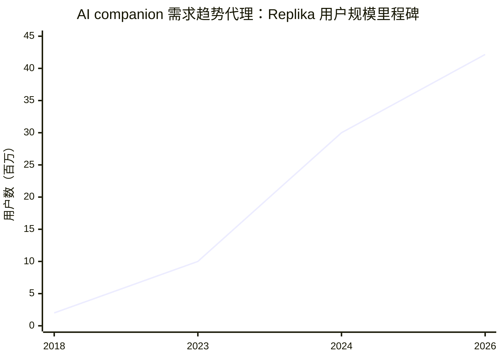
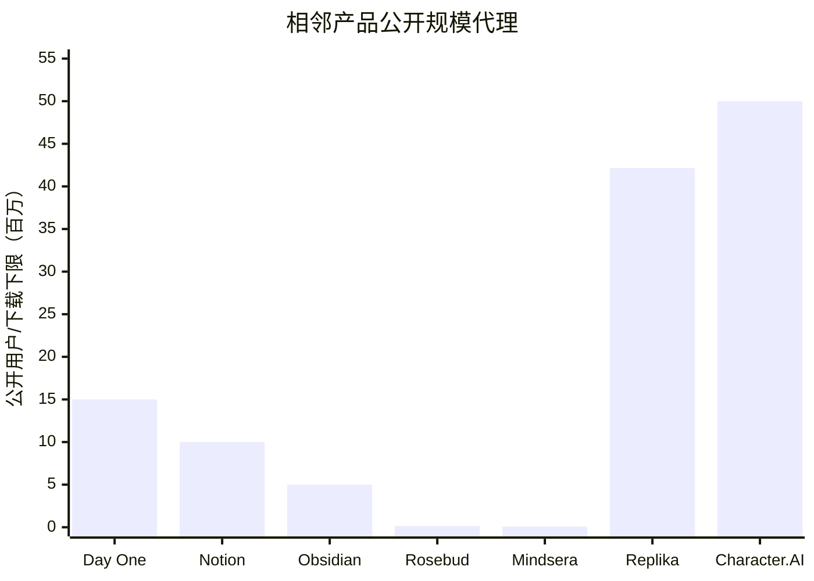
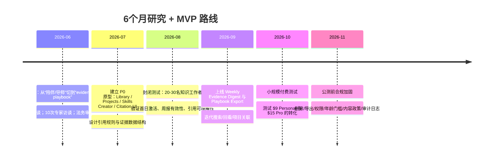

# Spark Vault 海外市场需求研究报告

## 执行摘要

结论先行：**Spark Vault 在海外市场有需求，但“需求存在的位置”并不在“AI 心理陪伴/名人模拟”这条风险最高的叙事线上，而在一个更窄、更专业、但更可持续的交叉带——个人知识管理、反思/journaling、AI 辅助总结，以及“把学习转成可复用行动系统”的个人 operating system。** 你们上传的产品设计里，核心资产已经不是传统日记，而是**证据链接的洞察、可复用的 Skills、按主题组织的 Projects、个人 Library、以及带引用规则的摘要/报告**。这与海外现有强需求赛道明显相邻：Day One 证明了 journaling 的长期付费需求，Obsidian/Notion/Reflect 证明了“second brain / note graph / personal workspace”的强需求，而 Replika / Character.AI 则证明了“带记忆的个性化 AI 互动”能形成巨大流量，但同时也带来了明显的监管与品牌风险。fileciteturn0file0 citeturn12view1turn41view4turn38view0turn46view0turn44view5

从市场信号看，海外用户已经为相邻价值持续付费。Day One 在 iOS 端有 **117K Ratings / 4.8 分**，Google Play 有 **1M+ installs / 26.4K reviews**，并在商店文案中披露“全球超过 1500 万下载”；Notion 在 Google Play 有 **10M+ installs / 363K reviews**；Obsidian 在 Google Play 有 **5M+ installs / 17.1K reviews**；Character.AI 在 Google Play 达到 **50M+ installs / 2.32M reviews**；Replika 官网显示 **4216 万+ 用户**。垂直 AI journaling 也不是“没有市场”：Rosebud 官网披露 **150K+ users / 5,311 ratings**，Mindsera 披露 **80,000 users / 200M+ words written**。与此同时，2024 年美国移动应用市场**下载量略降至 123 亿**，但**内购收入同比增长 16% 至 524 亿美元**，说明“用户不再盲目下载更多 App，但愿意为更高价值、长期使用的 App 付费”。AI 应用已显著占据主流榜单，2026 年 4 月美国 App Store 免费榜前六中有四个是 AI 应用；2025 年 ChatGPT 单年下载量被 Appfigures 估算为 **4.108 亿次**。citeturn11view0turn12view1turn43view0turn44view1turn44view5turn46view0turn39view0turn40view4turn24news3turn51news1turn51news0

真正的问题不是“有没有需求”，而是**Spark Vault 应该吃哪部分需求**。海外市场已经对“AI 朋友/AI 恋人/AI 心理陪伴”表现出极高热度，但这条路的监管、伦理与品牌代价也最高：2025 年 Common Sense Media 调查显示 **72% 美国青少年用过 AI companions**，**34%** 曾因 AI 的言行感到不适，约 **1/4** 承认分享过姓名、秘密等个人信息；研究对 Character.AI 青少年 Reddit 叙事的分析也显示出**睡眠受损、学业下降、现实关系受损**等过度依赖迹象。美国州层面的 companion chatbot 法规已经开始出现，英国 Ofcom 已将“模仿真实人物的聊天机器人”明确纳入 Online Safety Act 的关注范围；FTC 对健康/疗效类宣传要求“competent and reliable scientific evidence”，这意味着任何“疗愈、减轻焦虑、治疗抑郁、诊断、教练替代治疗师”的外部宣传都会显著提高合规难度。citeturn30news0turn30news1turn22academia12turn30news2turn55news0turn54view0turn54view2

因此，我的判断是：**方向正确，但必须收窄定位。** 最佳叙事不是 “AI understands you emotionally”，而是：  
**“Turn what you learn and what you actually do into an evidence-linked personal playbook.”**  
中文可理解为：**把学习、实践、复盘和证据，沉淀成你自己的方法论系统。**  
这个定位既能承接 journaling/PKM/AI memory 的真实需求，又能避开心理治疗、名人模仿、情绪依赖等高风险区。支撑这个结论的还有一个很重要的用户信号：不少用户并不反对 AI 本身，他们反对的是**AI 擅自介入、人格化过度、广告和付费门槛打断体验、以及缺少搜索/导出/可控性**。Notion 的 Google Play 可见评论里，典型差评就集中在“AI 强塞”；Character.AI 的高下载并没有带来高商店口碑，Google Play 当前只有 **1.4 分**，差评集中于广告和 UI 退化。citeturn43view0turn44view5turn44view4

如果按这个收窄后的方向推进，Spark Vault 的推荐 MVP 很清晰：**先做“证据链接 + Skills 创建器 + Projects + 周/周度证据摘要 + 导出式 Playbook”，暂时不做“虚拟陪伴”和“心理干预式反馈”。** 定价上，海外 C 端相邻产品的主流带宽已经很明确：Day One Silver 约 **$8.99/月**，Rosebud **$12.99/月**，Mindsera **$14.99/月**，Reflect **$10/月（按年付）**，Character.AI+ **$9.99/月**，mymind 的中高档位在 **$7.99–12.99/月**，Notion 个人/专业协作层在 **$10–20/席位/月**。这意味着 Spark Vault 作为个人专业成长工具，最可行的价格带大致是 **$9–12/月 的 Personal** 和 **$15–19/月 的 Pro**。citeturn12view2turn39view0turn40view1turn38view0turn44view7turn42view0turn37view0

## 产品方向判断

你们当前设计里最有价值、也最适合海外市场的一点，是它不是单纯“写日记”，而是强调**所有洞察都可追溯到过去内容与引用证据**，并且把“学习到的框架”和“真实发生的实践记录”放进同一个系统里，再通过 Projects/Reports/Skills 做长期复用。这个组合，实际上补上了当下主流产品之间最明显的断层：  
Day One 擅长记录与回忆，但更像“私密日记 + AI 辅助反思”；Obsidian / Reflect / mymind 擅长 capture、链接和回忆，但较少把“实践—反思—方法论沉淀”做成结构化闭环；Replika / Character.AI 擅长记忆与互动，但目标是 companionship 而不是“证据化成长系统”。fileciteturn0file0 citeturn11view0turn41view4turn38view0turn42view0turn46view0turn44view7

因此，**Spark Vault 最优的海外定位不是“AI 日记”也不是“AI 教练”，而是“evidence-linked reflection system”或“personal evidence engine for growth”。**  
这里有三个原因。

第一，海外用户已经熟悉“notes / workspace / second brain / journal / AI assistant”这些入口，但对 **personal knowledge management** 这种术语的搜索和大众认知相对更圈层化。Reflect 官网直接用 “second brain” 描述产品，Obsidian iOS 商店文案也直接使用 “second brain”；而 Day One、Rosebud、Mindsera 都更偏向 “journal / reflection / personal growth / mental fitness” 这类收益导向表述。也就是说，**用户买的不是“方法论名词”，而是“我以后能回看、能复用、能变得更清楚”**。citeturn38view0turn44view2turn12view1turn39view0turn39view3

第二，**“Skills” 作为内部核心机制是可行的，但不应该成为首页第一关键词。** 海外用户已经接受“自定义 agent / chatbot / AI workflow”的心智：Notion 已公开售卖 “Custom Agents”，Character.AI 也把 “Make Your Own Chatbot” 放进商店标题；所以，把 Skills 理解成“带参考资料、规则、角色立场的可复用 AI 配置”是成立的。问题不在于这个词能不能用，而在于**必须避免把 Skills 讲成“模仿名人/替代真人”的人格体**。更安全的表达是：  
**Skills = reusable AI configurations for a specific lens, domain, or framework.** citeturn37view0turn44view7

第三，**你们的最大卖点其实不是“更聪明”，而是“更可验证”。** 在用户对 AI 幻觉、AI 乱总结、AI 乱下结论越来越敏感的背景下，Spark Vault 的“每条结论都有出处、每个报告都能回到原始证据、可以区分学到的框架与真实做过的事”这一点是非常有竞争力的。这种思路也天然比“情绪评分”“人格分析”“像治疗一样对话”更安全。FTC 对 health-related claims 的标准很高，而用户对 AI 伴侣的担忧越来越集中在依赖、误导与越界上；因此，把产品定义成**“evidence-linked reflection and decision system”**，会比“AI therapist / AI mentor / AI companion”更容易建立长期品牌资产。citeturn54view0turn54view2turn29academia4turn22academia12

我对产品方向的最终判断是：**方向基本正确，但要坚决砍掉高风险叙事，只保留高价值结构。**  
建议保留与避免的边界如下。

| 模块/叙事 | 建议 | 原因 | 主要依据 |
|---|---|---|---|
| 证据链接洞察、引用 UI | 强烈保留 | 是 Spark Vault 与普通 AI journaling/PKM 的核心差异化 | 设计稿；FTC/AI 可信度环境 fileciteturn0file0 citeturn54view1turn51academia8 |
| Skills 创建器 | 保留，但定义为“lens/framework/domain config” | 符合海外对 agent/config mental model；避免人格模拟 | Notion Custom Agents；Character.AI 自建角色 citeturn37view0turn44view7 |
| Projects | 强烈保留 | 把“学习亲密关系/工作人际/管理/决策”等长期主题容器化，最适合变成可复盘资产 | 设计稿；Reflect/Obsidian 的长期知识组织心智 fileciteturn0file0 citeturn38view0turn44view2 |
| Weekly Evidence Digest / Practice Gap Report | 保留 | 形成留存与输出闭环，且不需要走心理治疗叙事 | Day One 已把 AI summary/daily chat 做成付费价值点 citeturn11view0 |
| 导出式 Playbook | 强烈保留 | 输出可分享、可打印、可迁移的方法论是高价值终局 | Day One/Reflect/Obsidian 都强调导出/可迁移/本地所有权 citeturn11view0turn38view0turn41view4 |
| 名人模仿 / 真实人物 persona | 避免 | 英国已有直接监管关注，品牌风险极高 | Ofcom/OSA 相关报道 citeturn55news0 |
| “therapy / diagnosis / mental health treatment” 宣称 | 避免 | FTC 科学证据门槛高；心理/医疗合规成本高 | FTC 指引 citeturn54view0turn54view2 |
| 情绪得分、病症级标签 | 慎做 | 会把产品推向 wellness/mental health claims 区域 | FTC；AI companion 舆论与案例 citeturn54view2turn19news0 |

## 市场规模与需求信号

如果只问“Spark Vault 这种完全同名同类产品有没有现成大市场”，答案并不乐观；但如果问“它所处的几个相邻需求带是否足够大”，答案是明确的：**大，而且已被验证为可付费。**

最强的外部信号来自三层。  
第一层，是**AI 应用作为大类已经进入主流下载榜**。2026 年 4 月，Sensor Tower 数据显示美国 App Store 免费榜前六有四个是 AI 应用；2025 年 ChatGPT 的全球下载量被 Appfigures 估算为 4.108 亿次，OpenAI 同年公开周活跃用户达 8 亿。第二层，是**高频个人产出与记录工具仍具付费韧性**。美国移动应用 2024 年下载量下滑到 123 亿，但内购收入增长 16% 至 524 亿美元，意味着高价值、长期型应用反而更容易吃到付费增长。第三层，是**与 Spark Vault 直接相邻的子赛道已经各自跑出规模**：Day One、Notion、Obsidian 说明“记录—组织—反思—检索”是长期需求；Rosebud 与 Mindsera 说明“AI 参与反思/分析/成长反馈”已经有人买单；Replika 与 Character.AI 则说明“带记忆、持续互动、个性化 AI”具备很强的用户粘性，但也带来高风险。citeturn51news1turn51news0turn24news3turn12view1turn43view0turn44view1turn39view0turn40view4turn46view0turn44view5

下面这张趋势图不是“Spark Vault 所在精确品类规模”，而是**它最危险也最热的相邻赛道——AI companion——的需求上升信号**。Replika 从 2018 年 200 万用户增长到官网 2026 年披露的 4216 万+ 用户，说明“有记忆、长期相处、个性化 AI”是极强需求；这也解释了为什么 Spark Vault 应该借用“记忆 + 个性化”的能力，但避免走 companion 叙事。citeturn45search2turn46view0

再看一个更贴近 Spark Vault 的“公开规模代理图”。注意这里混合了**安装量下限、官网披露用户数与下载量**，因此它不是严格可比的 MAU 图，而是用来回答一个更实际的问题：**海外用户是否已经在为相邻价值付费、评分、留下大量反馈。**答案是肯定的。citeturn12view1turn43view0turn44view1turn39view0turn40view4turn46view0turn44view5turn44view9

原始数据如下。

| 指标 | 数值 | 说明 | 来源 |
|---|---:|---|---|
| 美国 2024 App 下载量 | 12.3B | 低于 2023 年 12.6B 与 2022 年 12.7B | Sensor Tower 经 Investopedia 转述 citeturn24news3 |
| 美国 2024 App 内购收入 | \$52.4B | 同比增长 16%，2023 年约 \$45.2B | Sensor Tower 经 Investopedia 转述 citeturn24news3 |
| ChatGPT 2025 年下载量 | 410.8M | Appfigures 估算 | Business Insider / Appfigures citeturn51news0 |
| Day One 公开下载量 | 15M+ | 商店文案披露全球下载 | Apple/Google Play 文案 citeturn12view1turn11view0 |
| Notion Google Play 安装量 | 10M+ | 大众 productivity/notes 需求代理 | Google Play citeturn43view0 |
| Obsidian Google Play 安装量 | 5M+ | second brain/linked notes 需求代理 | Google Play citeturn44view1 |
| Rosebud 用户数 | 150K+ | 垂直 AI journaling 需求代理 | 官方站点 citeturn39view0 |
| Mindsera 用户数 | 80K+ | 垂直 AI journaling/mental fitness 需求代理 | 官方站点 citeturn40view4 |
| Replika 用户数 | 42.16M+ | 官网实时披露 | 官网 citeturn46view0 |
| Character.AI Google Play 安装量 | 50M+ | companion/character interaction 超大盘需求代理 | Google Play citeturn44view5 |

关于你要求的**关键词 volume**，公开可验证的精确数据在这个赛道并不好拿：Google Trends 的原始比较页、SEO 平台的绝对 volume 往往需要登录或付费，因此本报告用**更可靠的公开代理**来判断用户会搜索和会转化的词。高可用的 landing page 主词应优先使用 **journal / reflection / notes / second brain / AI-powered notes / personal growth** 这类用户已被教育过的词，不建议把 **personal knowledge management** 作为首页第一关键词——它适合内容 SEO、播客、创作者渠道，不适合冷启动广告文案。这个判断来自产品本身的命名与下载分布：Day One、Rosebud、Mindsera 都主打 journal / growth，Reflect 和 Obsidian 虽使用 second brain 心智，但仍主要通过 notes / writing / linked notes 教育用户。citeturn12view1turn39view0turn39view3turn38view0turn44view2

## 竞品格局

Spark Vault 的真正竞争不是单一产品，而是三类产品共同构成的“替代堆栈”：  
一类是 **记录与反思工具**，如 Day One、Rosebud、Mindsera；  
一类是 **PKM / second brain / workspace**，如 Obsidian、Reflect、mymind、Notion；  
还有一类是 **记忆型 AI 互动产品**，如 Replika、Character.AI。  
Spark Vault 想拿到 PMF，必须在这三类之间选边站位：**借 PKM 的“可控与可迁移”，借 journaling 的“反思与复盘”，借 AI companion 的“个性化记忆”，但不要继承它们的合规风险。**

| 产品 | 赛道 | 核心能力 | 公开定价 | 公开规模代理 | 资金/状态 | 对 Spark Vault 的启示 | 主要来源 |
|---|---|---|---|---|---|---|---|
| Day One | Journaling | 私密日记、多媒体、E2EE、回顾、AI Daily Chat/总结 | Silver \$8.99/月或 \$49.99/年；Gold 另售 | iOS 117K Ratings/4.8；Play 1M+ installs/26.4K reviews；全球 15M+ downloads | 已被 Automattic 体系收购运营 | 证明 journaling 有长期付费；也证明 AI 可作为增购层，而不是产品本体 | citeturn12view1turn12view2turn11view0 |
| Rosebud | AI Journaling / Growth | AI journaling、模式发现、周报、目标/习惯、情绪与成长支持 | \$12.99/月；年付折后 \$107.99/年 | 150K+ users；5,311 ratings；4.73/5 | 融资未披露 | 与 Spark Vault 最近，但更靠近 emotional support；可借鉴 weekly report 与 patterning | citeturn39view0 |
| Mindsera | AI Journal / Mental Fitness | 情绪分析、对话式 journal、框架模板、语音、周报 | 免费 + Genius \$14.99/月 或 \$129/年 | 80K+ users；200M+ words；168 countries | 自称独立公司；融资未披露 | 证明“框架 + journal + AI 分析”有需求；但 mental wellbeing 叙事带来更高合规压力 | citeturn40view4turn40view1 |
| Reflect | Notes / Second Brain | backlinks、日历、E2EE、AI chat with notes、网页裁剪 | \$10/月（按年付） | 未披露公开用户数 | 未披露 | 证明“second brain + AI”有清晰付费心智；适合作 Spark Vault 的理性竞品对标 | citeturn38view0 |
| Obsidian | PKM / Linked Notes | 本地 Markdown、图谱、插件、Sync/Publish、本地优先 | 核心免费；Sync \$5/月或 \$4/月（年付）；Publish \$10/月或 \$8/月（年付） | Play 5M+ installs；iOS 2.5K Ratings/4.5；公开文章称约 100 万用户 | 100% user-supported；强调无投资人影响 | 强烈验证 privacy-first / local-first 的吸引力；也揭示学习门槛是问题 | citeturn41view4turn44view1turn44view2turn49search0 |
| mymind | AI capture / visual memory | 自动分类书签、AI image tagging、摘要、隐私承诺 | \$7.99/月；\$79/年；高档 \$12.99/月；\$129/年 | 公开用户数未披露 | 明示 zero outside funding | 证明“保存—找回—不必整理”有人愿意付费；很适合 Spark Vault 的 Library 参考 | citeturn42view0 |
| Notion | Workspace / Knowledge | 文档、数据库、项目、AI、Meeting Notes、Agent、Enterprise Search | Plus \$10/席/月；Business \$20/席/月；Custom Agents 另按 credits 计费 | Play 10M+ installs；363K reviews | 2021 年融资 \$275M，估值 \$10B，公开用户数 20M（2021） | 证明“all-in-one workspace + AI”是大市场，但个人成长/证据化反思不是其核心用例 | citeturn37view0turn43view0turn50search0 |
| Replika | AI Companion | 长期记忆、关系感、个性化 AI 互动 | Freemium（公开网页未披露现行价格） | 官网 42,160,934 users；Play 10M+ installs/524K reviews | BI 报道累计融资 \$11M；现已换 CEO | 证明记忆型 AI 的留存潜力巨大，但合规/品牌/依赖风险同样巨大 | citeturn46view0turn44view9turn45news1 |
| Character.AI | Character / UGC AI | 自建角色、超大角色库、互动娱乐 | Character.AI+ \$9.99/月或 \$94.99/年 | Play 50M+ installs / 2.32M reviews；iOS 535K ratings/4.3 | 融资信息未在本次公开样本中完整核实 | 证明自定义 persona 极易爆发，但平台治理、广告、内容与年龄风险极高 | citeturn44view5turn44view6turn44view7 |

这张表最关键的结论不是“谁功能最多”，而是：**还没有一家产品把“学习框架 + 真实实践证据 + 可复用 AI configs + 项目化复盘 + 可导出方法论”组合成一个清晰、安全、专业的产品叙事。**  
Day One 太偏 journaling；Obsidian/Reflect 太偏 notes；Rosebud/Mindsera 太靠近 wellness；Replika/Character.AI 太靠近 companionship。  
Spark Vault 的白空间，正好在它们之间。citeturn11view0turn38view0turn39view0turn39view3turn46view0turn44view7

## 用户研究综合

用户研究层面，最重要的发现是：**海外用户并不是单纯想要“更会说话的 AI”，他们真正要的是四件事——低摩擦记录、可回溯记忆、能把散点信息串起来的洞察、以及对个人数据的控制感。** 当 AI 过度人格化、打断、强行插入、广告化、或者给出看似“懂你”却不可验证的结论时，用户就会明显反感。这个结论同时来自大样本研究、平台评论和竞品公开反馈。citeturn51academia8turn11view0turn43view0turn44view4

先看大样本与研究证据。

| 研究/调查 | 样本 | 关键发现 | 对 Spark Vault 的意义 | 来源 |
|---|---:|---|---|---|
| 173 个 Gen-AI App 的 676,066 条 Google Play 评论分析 | 676,066 reviews | 用户讨论高频集中在 AI 性能、内容质量、内容政策/限制等 | “AI 是否有用、是否出错、是否越界”仍是用户核心评判标准 | citeturn51academia8 |
| MindScape AI journaling 研究 | 20 名大学生，8 周 | 正向情绪 +7%，负向情绪 -11%，孤独 -6%，正念 +7%，自我反思 +6% | “上下文感知、个性化提示”有真实使用价值，但样本仍小，不能作为 marketing claim 直接外推 | citeturn19academia9 |
| 青少年 Reddit 对 AI companion 过度依赖研究 | 318 帖 | 常见后果为睡眠损失、学业下降、现实连接受损 | 说明 Spark Vault 必须回避 companion/依赖式设计 | citeturn22academia12 |
| Common Sense Media 青少年 companion 调查 | 美国青少年 | 72% 用过 AI companions；34% 曾感不适；约 25% 分享过个人信息；约三分之一会用它处理严肃个人问题 | companion 需求是真的，但也带来未成年人、隐私、心理依赖风险 | citeturn30news0turn30news1turn30news5 |
| Rosebud 自有用户调查 | 1,300 users / 7 days | 60% 报告 anxiety 改善、64% depression、54% anger 等 | 说明“成长/情绪改善”叙事有吸引力，但属于供应商自报，不能直接照搬其 marketing 风格 | citeturn39view0 |

再看公开评论与评价信号。以下是我基于**可见评论/推荐语小样本人工编码**得到的主题分布。样本不是统计意义上的全量评论，而是为了判断“需求方向”和“雷区”最有帮助的公开文本，主要来自 Google Play、App Store 与官网可见推荐语，透明起见把它当作**定性+半定量**证据。citeturn11view0turn43view0turn44view0turn44view4turn38view0turn39view0turn39view3

| 主题 | 小样本频次 | 典型证据 | Spark Vault 启示 |
|---|---:|---|---|
| 低摩擦 capture 与组织 | 6/12 | Day One 的图片/链接/多 journal；Notion “everything app”；Reflect “simple/fast”；Obsidian canvas | 首日体验必须极顺，不要先教育“系统理论”，先让用户 3 分钟内存进去并找得回 |
| 跨设备、搜索、导出 | 4/12 | Day One 跨端编辑被赞，但“note 内搜索”被喷；Reflect/Obsidian 重视同步/导出 | 搜索与导出不能做成后置功能，尤其要支持“按项目/按证据回看” |
| 记忆与模式发现 | 5/12 | Rosebud、Mindsera 都把 pattern/analysis/report 放前台；Replika/companion 类把“记得你”作为核心卖点 | Spark Vault 可以继承“记忆”能力，但必须给出处与可控性 |
| 用户反感 AI 强塞 | 3/12 | Notion 商店评论直接表达对 AI rebrand/AI 打扰反感 | AI 必须是用户拉起，不是默认打断；建议所有自动洞察可关闭 |
| 广告/Paywall 摩擦 | 3/12 | Character.AI 差评集中在广告与体验割裂；Guardian 对 Mindsera 也提到付费关系带来的失落 | 不要靠“上瘾后锁功能”赚钱，应该卖“更强的组织与输出能力” |
| 隐私/安全 reassurance | 4/12 | Day One E2EE、Reflect E2EE、Obsidian 本地数据、Mindsera 不用用户数据训练模型 | 隐私必须成为购买理由，而不是事后 FAQ |

愿意付费的证据也相当明确。消费者愿意为“反思/知识/成长类工具”持续付费，但价格天花板不高，且要求价值非常具体。当前公开价位高度收敛在**\$8.99–14.99/月**：Day One Silver \$8.99/月、Rosebud \$12.99/月、Mindsera \$14.99/月、Reflect \$10/月、Character.AI+ \$9.99/月、mymind 主流档 \$7.99–12.99/月。也就是说，对个人用户而言，**“我每个月愿不愿意为它花 10 美元”** 是最现实的门槛，超过这个门槛就必须给出**明确、持续、专业、可导出的回报**。Spark Vault 如果要过这个门槛，不能只承诺“更懂你”，而要承诺“每周帮你沉淀一个能反复使用的 playbook”。citeturn12view2turn39view0turn40view1turn38view0turn44view7turn42view0

## 监管与法律风险

如果 Spark Vault 在海外要走长线，法律与定位问题不能留到上架后再补。**它最需要的不是“更强模型”，而是“更窄、更清晰的合规边界”。**

在欧盟，最基础的风险来自 **GDPR**。只要产品处理用户的 journal、反思、决策记录、关系问题、职业困惑等内容，就很容易触碰到**敏感或高度私密的个人数据**。GDPR 的适用文本明确列出：儿童同意（Art. 8）、自动化决策/画像（Art. 22）、privacy by design & by default（Art. 25）、安全处理（Art. 32）、DPIA（Art. 35）、以及跨境传输（Art. 44 及后续条款）都是关键义务。对于 Spark Vault，这意味着至少要做到：**清晰的 lawful basis、敏感内容的 explicit consent 策略、可删除/导出、默认最小化采集、区域化托管或清晰的跨境传输机制，以及高风险功能上线前做 DPIA。** citeturn53view1turn56view0turn56view1turn56view2turn56view3turn56view4turn56view5

欧盟第二层风险来自 **AI Act**。公开文本整理站点显示，AI Act 为某些 AI 系统设置了**透明义务（Art. 50）**，为**通用 AI 模型（Art. 53）**规定了特殊义务，并且整体法规自 **2026 年 8 月 2 日** 起开始适用（部分条款例外）。对 Spark Vault 来说，含义不是“你现在就会被归入高风险 AI”，而是：**如果产品开始做自动建议、画像、长期记忆和可能影响用户重要决定的报告，就必须主动建立透明度、人工可审查以及记录留痕。** 这也再次说明，引用链和 evidence UI 不只是产品优势，也会是合规优势。citeturn58view0

在美国，最重要的不是某一部单独的“AI 成长产品法”，而是两类现实风险。第一类是 **FTC 对健康/疗效宣称的监管**。FTC 的《Health Products Compliance Guidance》写得非常明确：健康相关广告必须真实、不误导；任何 objective claims 在发布前都必须有充分证据；对于 efficacy 或 safety 相关 health claims，FTC 一般要求“competent and reliable scientific evidence”，并指出通常需要高质量科学研究，很多情况下是随机对照临床证据。对 Spark Vault 的直接含义是：**不要做“改善抑郁/缓解焦虑/治疗创伤/替代教练或治疗师”的外部宣传。** 你可以说它帮助用户“organize reflections”、“review evidence”、“create a personal playbook”、“track practice against principles”，但不要碰 medical / therapeutic claims。citeturn54view1turn54view0turn54view2

美国第二类风险来自**AI companion 与青少年安全**的州级监管和执法趋势。Reuters 2025 年底报道指出，纽约和加州已开始为 AI companions 画出第一批监管边界，包括非人类披露、未成年人保护、公共报告与伤害预防要求。这说明只要产品被市场或监管机关理解为“正在模拟持续情感关系的 AI companion”，合规成本会迅速上升。Spark Vault 如果把自己讲成“AI friend / coach / companion”，会被推入一条不必要的高风险赛道。citeturn30news2

英国的风险则集中在 **Online Safety Act 与 Ofcom 对 impersonation / harmful chatbot content 的关注**。2024 年 Ofcom 已就模仿 Brianna Ghey、Molly Russell 等真实人物的聊天机器人向科技公司发出警告，并明确把这类 chatbot 内容放在 Online Safety Act 下审视；2026 年 Ofcom 还对 X/Grok 相关 AI 图像与深伪风险启动调查。这对 Spark Vault 有两个明确影响：  
一是**不要提供真实人物、名人、逝者、公众人物的模仿式 Skills/personas**；  
二是如果产品支持用户自定义 Skills，**需要有内容政策和审核规则，避免被用户拿去做 risky impersonation。** citeturn55news0turn55news1

相关风险与建议可以压缩成下面这张表。

| 风险项 | 风险等级 | 为什么重要 | 对定位/功能的直接影响 | 建议 |
|---|---|---|---|---|
| GDPR 敏感数据处理 | 高 | journal 内容天然可能含健康、关系、政治、宗教等敏感信息 | 影响数据结构、权限、日志、删除、出口与 EU 拓展 | 默认最小采集；显式同意；导出/删除；EU 区域化；DPIA |
| AI Act 透明义务 | 中高 | 2026-08-02 起适用，透明与记录义务增加 | 影响自动报告、长期记忆、画像与解释 | 每条洞察可回溯；显示“AI 生成 + 引用来源 + 用户可编辑” |
| FTC 健康/疗效宣称 | 高 | 一旦越界到“治疗/疗效”就需要强证据 | 影响 landing page、广告词、PR 与 case study 语言 | 全面避免 therapy/diagnosis/treatment 词汇 |
| AI companion 州级监管 | 中高 | 加州/纽约已开始立法 | 影响是否被认定为 companion、是否需 minors safeguards | 不做 companion 定位；18+ 起步；不做情感依赖设计 |
| 英国在线安全/真实人物模仿 | 高 | Ofcom 已明确关注 chatbot impersonation | 影响 Skills 自定义边界 | 禁止 celebrity/real-person personas；仅允许 framework/role-based skills |
| 平台与数据跨境风险 | 中高 | 日记与反思数据极度私密 | 影响云托管、日志、第三方模型调用 | 模型调用最小化；敏感模式下可本地/可关；SCC/DPA 完整 |

## 商业化与 PMF 建议

综合市场信号、竞品结构、用户研究与监管边界，我给 Spark Vault 的 PMF 判断是：**有较高概率在“英语世界的知识工作者与成长型专业人群”中拿到早期 PMF，但前提是它必须被定义为“证据链接的个人成长操作系统”，而不是“AI 朋友”或“AI 心理产品”。** 这不是保守，而是更容易收敛到真正愿意付费、留存更稳定、监管更可控的用户群。

最值得优先打的三个细分人群是：  
其一，**知识工作者 / 独立顾问 / 创作者 / 创业者**。他们本来就在 Notion、Obsidian、Readwise、Reflect 之间流转，痛点不是“没有地方写”，而是**学了很多，却无法形成自己的方法论**。  
其二，**教练、咨询顾问、管理者、课程型创作者**。他们日常已经在使用 frameworks，但缺的是一个能把“原则—案例—复盘—个人偏好”连起来的证据系统。  
其三，**重度 PKM 用户**。这批人对图谱、链接、导出、Markdown、本地/隐私极敏感，虽不是最大众，但最容易成为种子用户与社区传播者。与此相反，**青少年、情感陪伴用户、明显寻求心理支持的脆弱群体不应作为第一批目标市场。** citeturn38view0turn41view4turn46view0turn30news2turn54view2

商业化上，最佳方案不是一次性把所有能力都卖给所有人，而是采用**双层个人订阅 + 后续专业扩展**。原因很简单：相邻市场已经把价格教育得很充分，主流可接受带宽就是 **\$9–15/月**。你不需要重新发明定价，只需要把价值讲得更具体。citeturn12view2turn39view0turn40view1turn38view0turn44view7turn42view0turn37view0

| 方案 | 建议价格 | 面向人群 | 包含内容 | 为什么可行 |
|---|---:|---|---|---|
| Personal | \$9/月 或 \$79/年 | 个人成长用户、创作者、学生后期可覆盖 | Library、Projects、基础 Skills、引用 UI、每周证据摘要、导出 playbook | 对齐 Day One / Reflect / mymind / Character.AI+ 的心理价位 |
| Pro | \$15/月 或 \$129/年 | 专业知识工作者、顾问、管理者 | 高级 Skills 创建器、更多项目、长期记忆、知行差距报告、模板市场/私有模板 | 对齐 Mindsera / Notion Business 之下的专业价值层 |
| Team/Coach | \$24–39/席位/月 | 教练/顾问小团队、课程组织者 | 多 workspace、共享 framework 库、客户/学员隔离空间、审计与权限 | 不是 MVP 必做，但能自然接到高客单价场景 |

功能优先级建议如下。这里的判断逻辑不是“技术上能做什么”，而是“什么最能在 90 天内证明用户会回来、会付费、而且不会把你推入监管红区”。

| 优先级 | 功能 | 为什么先做 | 为什么现在别做 |
|---|---|---|---|
| P0 | Evidence-linking | 这是 Spark Vault 最核心的品牌资产；也是反幻觉与合规优势 | 如果没有它，产品会退化成“又一个 AI 日记” |
| P0 | Skills Creator | 能把“方法/角度/学科框架”沉淀为可复用资产 | 但必须 strict 约束为 framework/role，而不是 celebrity/persona |
| P0 | Projects | 让“亲密关系、工作关系、管理、决策”等长期主题有容器 | 没有项目容器，周报与 playbook 很难成立 |
| P0 | Citation UI | 让每条结论可验证，是使用信任的底座 | 如果只是后台有引用，前台不可见，价值会被用户低估 |
| P0 | Exportable Playbook | 形成“学进去—做出来—拿得走”的闭环 | 不导出就难以体现长期资产感 |
| P1 | Weekly Evidence Digest | 它是最自然的 retention loop | 可在 P0 之后快速上线 |
| P1 | Practice Gap Report | 真正把“学到的”和“做到的”连起来 | 需要先有足够 Projects/证据密度 |
| P1 | Privacy controls | 对高价值用户是必需，而不是锦上添花 | 最迟需在公测前完善 |
| P2 | Voice journaling / mobile-first capture | 会提升频率 | 但不是差异化根本 |
| P2 | 分享/协作 | 有商业化潜力 | 过早做会干扰核心 PMF 验证 |
| 不建议首发 | Companion 模式 / 情绪打分 / 名人 persona | 会显著提升留存想象，但合规和品牌代价过高 | 不适合早期产品定位 |

留存逻辑也应围绕“证据资产”而不是“情绪依赖”来设计。更好的 retention loops 应该是：  
用户今日记录一条实践 → 系统把它与某个 Skill/Project 自动关联 → 周末生成带出处的 Evidence Digest → 月末导出一个章节化 playbook。  
这种机制比“来找 AI 聊天”更慢，但更稳，也更符合付费动机。它会把 Spark Vault 从 **session-based novelty** 推向 **asset-based retention**。这一点，与 Day One 的回顾功能、Reflect/Obsidian 的长期知识组织、本地/可导出所有权逻辑是一致的。citeturn11view0turn38view0turn41view4

在 Go-to-Market 上，我建议**先走内容与社区渗透，而不是一开始就做大众投放**。最有效的渠道不是“心理健康类广告位”，而是：PKM YouTube/Newsletter、管理/写作/课程类创作者、Notion/Obsidian/Readwise 社区、cohort-based course、独立顾问/教练群体。这些人天然理解“长期记录 + 方法论沉淀 + 可复用系统”的价值，也更容易接受“先上传你的 frameworks / references / logs，再让 AI 帮你形成自己的 playbook”。Spark Vault 的 demo 也应该围绕具体项目展开，比如：  
“把 30 天的管理日志变成你的 7 条一对一方法。”  
“把关系学习笔记和真实冲突记录合成一份 personal playbook。”  
“把你过去的决策记录归纳成一个 decision skill。”  
这种 demo 远比“AI 更懂你”更容易转化专业用户。fileciteturn0file0

下面给出一个浓缩版 SWOT。

| 维度 | 判断 |
|---|---|
| Strengths | 差异化强；证据链可验证；能承接学习与实践之间的 gap；隐私/可信度有机会成为购买理由 |
| Weaknesses | 类别教育成本高；用户需要先投入内容；比“聊天型 AI”慢热；若 UI 过复杂容易被误解为 another note app |
| Opportunities | AI companion 热但争议大，市场缺少“非治疗、非陪伴、可验证”的专业替代；PKM 与 AI journaling 之间存在明显空档 |
| Threats | Notion/Apple/微软等平台型玩家可能快速补齐；监管对 companion/wellness 收紧；用户对 AI 幻觉与隐私的耐受度下降 |

为了让研究与 MVP 同步推进，我建议 6 个月做成下面这条路线，而不是“大而全上架”。

最后，把你要求的**研究附录建议**压缩成三张实操表。

**建议问卷题目（首轮定量）**

| 题目 | 目的 |
|---|---|
| 你是否长期记录过日记、工作日志、学习笔记或决策复盘？频率如何？ | 筛选真实高频记录者 |
| 你现在使用哪些工具保存这些内容？为什么不满意？ | 明确替代堆栈与切换成本 |
| 你最大的痛点是什么：记不住、找不到、连不起来、不会复盘、不会转化成行动？ | 确认核心痛点排序 |
| 如果一个工具能把“学习到的框架”与“你真实做过的事”关联起来，你会觉得有价值吗？ | 验证核心价值假设 |
| 你是否信任 AI 自动总结你的私人内容？在哪些前提下你才信任？ | 验证 citations / evidence 的必要性 |
| 你更想要：更像笔记工具、日记工具、项目工具，还是成长操作系统？ | 验证 category language |
| 你愿意为这类工具支付多少？\$0 / \$5 / \$10 / \$15 / \$20+ | 初步价格敏感度 |
| 你最担心的是什么：隐私、误导、太复杂、上瘾、看起来像心理产品？ | 合规与产品边界验证 |

**建议访谈筛选器（首轮定性）**

| 条件 | 目标样本 |
|---|---|
| 过去 3 个月每周至少记录 3 次 | 高强度记录者 |
| 同时在用 Notion/Obsidian/Day One/Reflect/Readwise 中任意 1-2 个 | 已被教育过的相邻赛道用户 |
| 自我认同为知识工作者/独立顾问/创作者/管理者/研究者 | 高概率付费人群 |
| 愿意分享真实工作/关系/学习项目的复盘方式 | 有真实 Projects 场景 |
| 不以“心理治疗替代”为主要诉求 | 避开高风险样本 |

**MVP 核心指标**

| 指标 | 定义 | 目标意义 |
|---|---|---|
| Activation | 首周内创建 ≥1 Project、上传 ≥3 条 references、生成 ≥1 次 cited insight | 验证“Spark Vault 不是空壳笔记本” |
| Citation verification rate | 用户打开洞察后查看引用来源的比例 | 验证 evidence-linking 是否真被感知 |
| Evidence reuse rate | 某条 reference 被多个 Skills/Reports 再使用的比例 | 验证“个人知识资产化”是否发生 |
| D7 / D30 retention | 7 日/30 日留存 | 反映产品是否进入个人系统 |
| Weekly active projects | 每周至少有一次新增证据或复盘的 Projects 数 | 衡量项目容器是否成为真实工作台 |
| Digest open rate | Weekly Evidence Digest 被打开与被收藏的比例 | 验证摘要是否有价值 |
| Playbook export rate | 月度导出率 | 反映“长期资产感”是否成立 |
| Paid conversion | Free → Personal / Pro 转化 | 验证定价带是否成立 |
| Privacy opt-in / opt-out | 是否启用 AI 分析、是否允许长期记忆 | 衡量用户对 AI 的真实信任边界 |

**优先数据源清单**

| 数据源 | 用途 | 优先级 |
|---|---|---|
| Apple App Store / Google Play 公页 | 下载、评分、评论、价格、数据安全标签 | 最高 |
| 官方定价页/官网 | 定位、功能、付款墙结构、隐私承诺 | 最高 |
| 学术论文 | 用户风险、依赖、隐私、交互效果 | 高 |
| Reuters / AP / FT / Guardian / The Verge | 政策、监管、行业动态、舆论争议 | 高 |
| Sponsor 自报调查（如 Rosebud/Mindsera） | 用于判断卖点与用户心理，但不能直接当疗效证明 | 中 |
| 付费 SEO / App intelligence 工具 | 用于后续精确买量和关键词优化 | 第二阶段 |

**Open questions / limitations**：本报告没有使用付费版 Sensor Tower、data.ai、Semrush/Ahrefs，因此没有给出你要求的“全量精确关键词 volume 列表”；当前可公开验证的需求判断主要依赖**官方商店数据、官网披露、主流新闻与学术研究**。此外，部分竞品的 MAU/融资并未在本次可公开抓取样本中完整披露，表格中以 `未披露/N.D.` 标注，避免伪精确。citeturn24news3turn51news1turn51news0turn39view0turn40view4

总体判断可以压缩成一句话：  
**Spark Vault 的海外方向是对的，但赢法不是“更像一个会陪你的 AI”，而是“更像一个会引用证据、能帮你把学习和实践变成个人方法论的系统”。**  
如果你把这条边界守住，它有机会成为一个小而强、付费意愿明确、留存靠资产沉淀而不是情感依赖的产品。