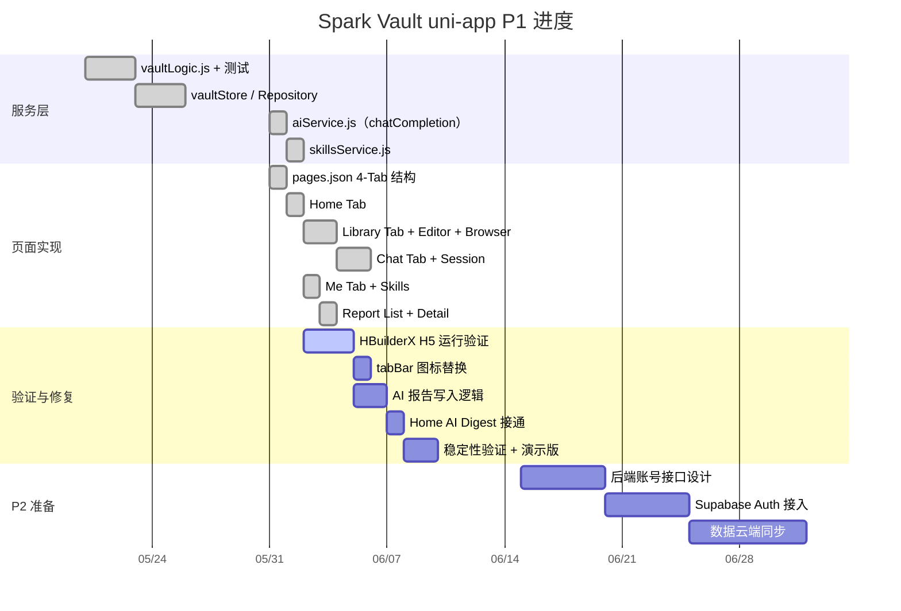

# 项目路线图

> 覆盖范围：全平台（Android + uni-app + 后端）  
> 更新时间：2026-06-02  
> 原始文件：[docs/roadmap.md](../roadmap.md)

---

## 总览

```
P0  Android 本地离线 APK   ████████████░░  暂缓（等验证）
P1  uni-app 跨平台 MVP      ████████████░░  代码完成，待验证
P2  云端 + 账号体系          ░░░░░░░░░░░░░░  计划中
P3  协作 + 社交分享          ░░░░░░░░░░░░░░  远期
```

---

## Gantt — P1 uni-app MVP



---

## P0 — Android 本地离线 APK

**目标**：单机可用，无需联网，AI 能力通过 DashScope 接入。

> ⚠️ **诚实状态说明**：以下功能的**代码已实现**，但尚未完成端到端运行验证。
> APK 曾出现 keystore 签名问题，用户装机后不知如何使用，需要补充验证 + 使用指南。

| 功能 | 代码状态 | 运行验证 |
|---|---|---|
| 片段采集（文本录入 + 元数据）| ✅ 代码完整 | ❓ 未验证 |
| Library 浏览、搜索、收藏 | ✅ 代码完整 | ❓ 未验证 |
| 按来源/标签过滤 | ✅ 代码完整 | ❓ 未验证 |
| AI 自动生成标签（DashScope）| ✅ 代码完整 | ❓ 未验证（需 API Key 注入） |
| AI 自动生成摘要 | ✅ 代码完整 | ❓ 未验证 |
| AI OCR 识图（Qwen 视觉）| ✅ 代码完整 | ❓ 未验证（Qwen 视觉支持待确认）|
| AI Workspace 合成报告 | ✅ 代码完整 | ❓ 未验证 |
| AI 周报生成 | ✅ 代码完整 | ❓ 未验证 |
| 本地 Room 数据库存储 | ✅ 代码完整 | ❓ 未验证 |
| 首次启动种子数据 | ✅ 代码完整 | ❓ 未验证 |
| Debug APK 打包安装 | ⚠️ keystore 问题已修复 | ❓ 未重新构建验证 |

**待做**：
- 用 Android Studio 重新 Build → Run（或打 Debug APK）
- 对照 [Android 使用指南](../guides/android_getting_started.md) 走一遍完整流程
- 把每一行 ❓ 改成 ✅ 或 ❌（发现问题记录到此处）

**交付物**：可安装到 Android 手机的 `.apk` 文件（需在 `.env` 中配置 DASHSCOPE_API_KEY）。

---

## P1 — uni-app 跨平台 MVP

**目标**：把 P0 的核心能力迁移到 uni-app，实现 H5 / 小程序 / App 多端可用，本地存储优先。

**导航结构（PRD v3.0）**：4 Tab（Home / Library / Chat / Me）+ 子页面（editor / browser / session / skills / report）

| 里程碑 | 内容 | 状态 |
|---|---|---|
| M1 | 纯逻辑层（vaultLogic.js）+ 测试全通过 | ✅ 完成 |
| M2 | Repository + Store 层 + 集成测试 | ✅ 完成 |
| M3 | 全部页面代码实现（13 个文件）| ✅ **2026-06-02 完成** |
| M4 | HBuilderX 运行验证 + bug 修复 | 🔄 进行中 |
| M5 | tabBar 图标 + AI 报告写入 + H5 演示版 | ⏳ 计划中 |

**M3 已交付页面清单（2026-06-02）：**
- `pages/home/index.vue` — 首页统计 + Digest + 报告入口
- `pages/library/index.vue` — 内联捕捉 + 碎片列表
- `pages/library/editor.vue` — 全屏编辑器
- `pages/library/browser.vue` — 全量浏览搜索
- `pages/chat/index.vue` — 聊天模式选择
- `pages/chat/session.vue` — 全屏 AI 对话（含导师选择）
- `pages/me/index.vue` — 我的页
- `pages/me/skills.vue` — Skills 管理
- `pages/report/list.vue` — 报告历史
- `pages/report/detail.vue` — 报告详情 + 反馈

**交付物**：H5 可在浏览器运行的演示版，微信小程序包（可选），Android App 包（可选）。

---

## P2 — 云端 + 账号体系

**目标**：数据上云，多设备同步，支持账号登录。

**前置条件**：P1 M5 完成（本地链路稳定）。

| 功能 | 说明 |
|---|---|
| 用户注册 / 登录（邮箱 + 密码）| 后端：FastAPI + Supabase Auth |
| 数据云端存储（片段 / 报告）| 后端：Supabase PostgreSQL |
| 多设备数据同步 | 本地 → 云端双写，冲突策略：最后写入胜出 |
| API Key 云端托管（可选）| 用户不再需要手动填写 DashScope key |
| 数据导出（JSON / Markdown）| 防止锁定效应 |

**不做（留 P3）**：多账号协作、共享 Collection、公开发布。

---

## P3 — 协作 + 社交分享（远期）

**目标**：多用户场景，内容可共享、可协作。

| 功能 | 说明 |
|---|---|
| Collection 共享（只读链接）| 把一组片段/报告分享给他人 |
| 多人协作编辑 | 类 Notion 多用户写入 |
| 公开发布（类小红书/知乎）| 报告/摘要一键发布为公开内容 |
| 关注 + Feed 流 | 关注其他用户的公开 Collection |

---

## 关键约束

| 项目 | 当前状态 |
|---|---|
| AI 提供商 | 阿里云 DashScope（qwen-plus），OpenAI 兼容接口 |
| 后端框架 | Python FastAPI（`backend/`） |
| 数据库 | P0/P1 本地；P2 起 Supabase PostgreSQL |
| 认证 | P2 起 Supabase Auth（邮箱/密码，预留 OAuth）|
| 多账号协作 | **P3，不在当前计划内** |
