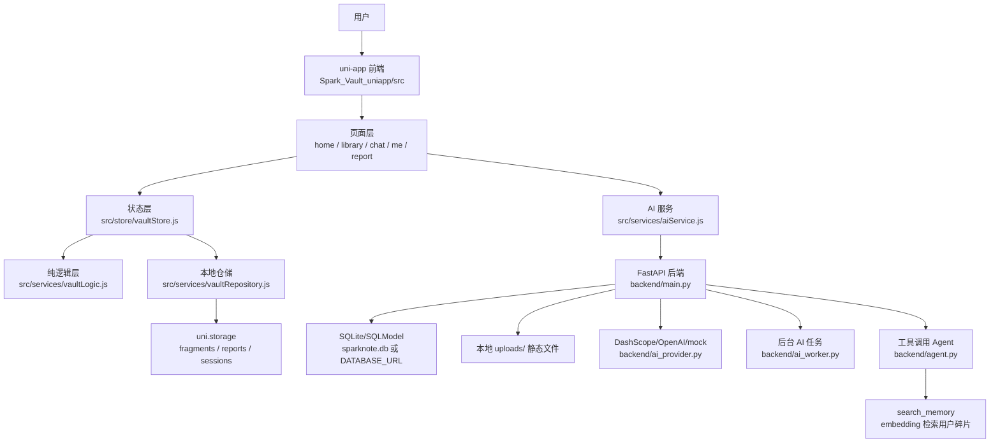
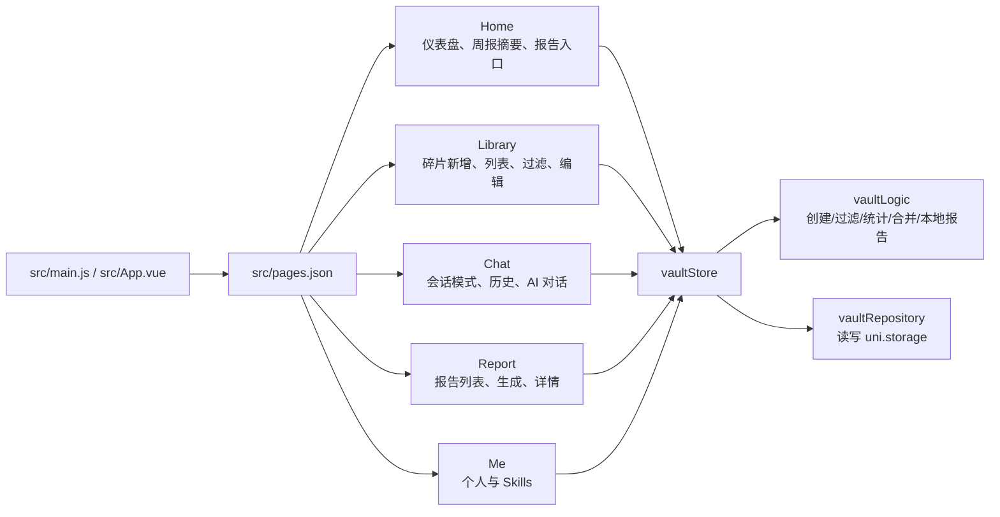
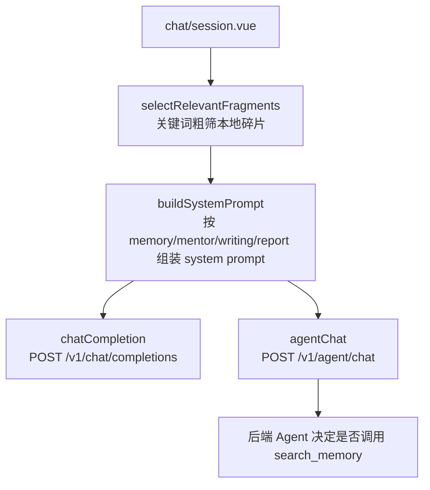
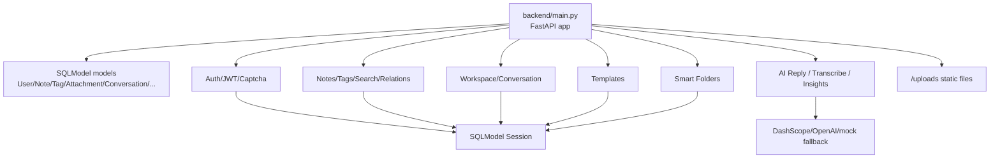
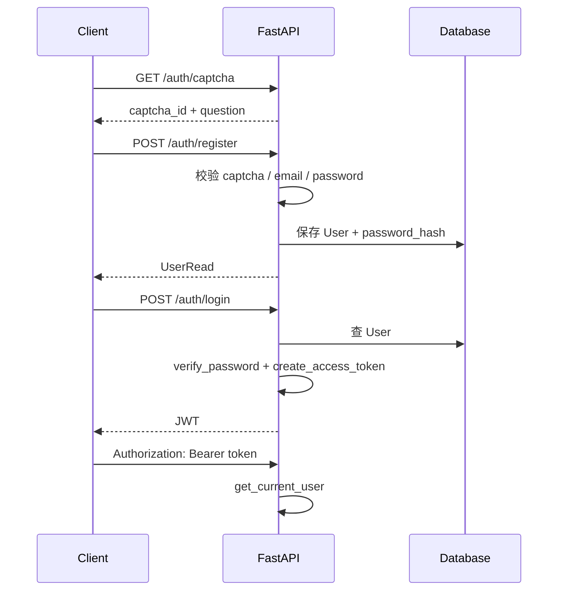
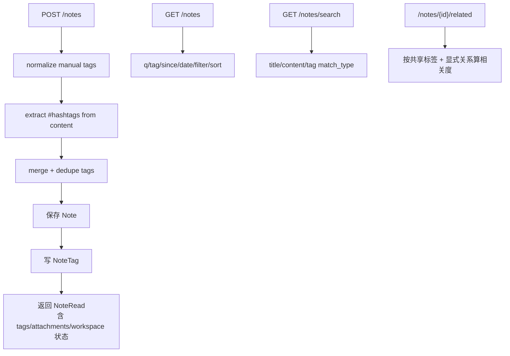
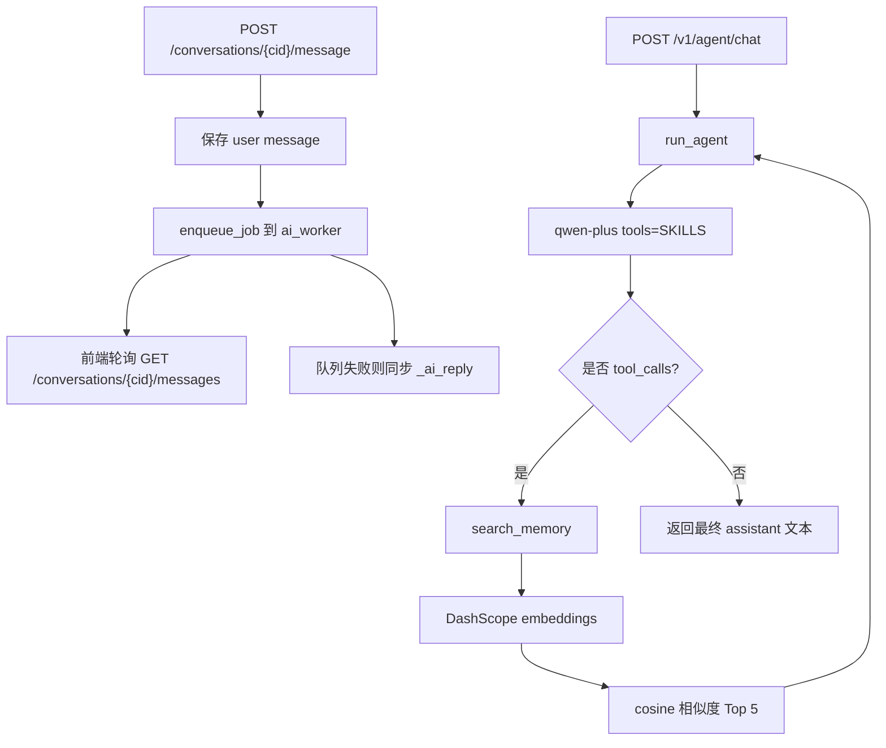
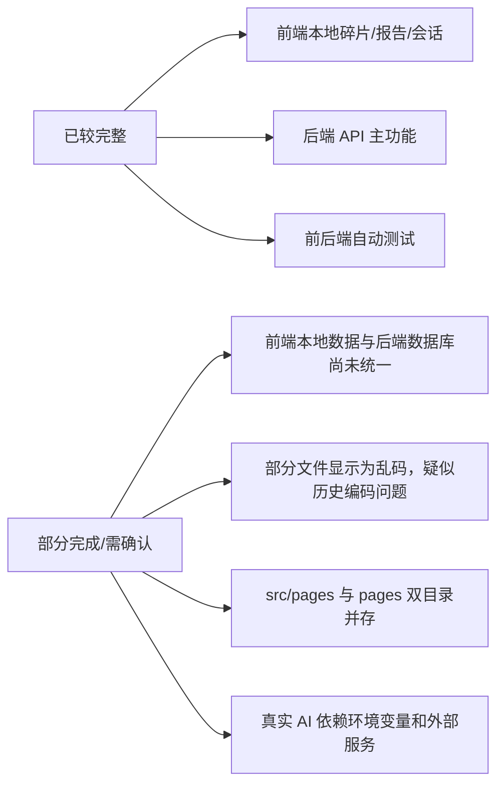

# MirrorMe 当前项目理解图谱

分析时间：2026-06-09

## 结论概览

MirrorMe 目前是一个“前端本地优先 + 后端能力增强”的个人知识碎片与 AI 反思应用。

- 前端主工程在 `Spark_Vault_uniapp/src/`，使用 Vue 3 + uni-app，当前 MVP 以本地存储为主。
- 后端在 `backend/`，使用 FastAPI + SQLModel，提供认证、笔记、标签、附件、AI 对话、洞察、模板、智能文件夹等接口。
- 前端和后端不是完全同构：前端核心数据仍写入 `uni.storage`，AI 对话相关能力通过 `VITE_API_BASE_URL` 指向后端。
- 根目录下 `Spark_Vault_uniapp/pages/` 与 `Spark_Vault_uniapp/src/pages/` 同时存在，README 指定正式源码在 `src/`，因此理解和后续改动应优先看 `src/`。

## 一张总图

## 前端怎么做的

### 页面层

- `src/pages/home/index.vue`：首页读取 store，展示碎片数、本周录入、会话数、报告数，以及本地 weekly digest。
- `src/pages/library/index.vue`：知识碎片列表和快捷录入。保存时调用 `store.saveFragment()`，最终落到本地 storage。
- `src/pages/library/editor.vue`：更完整的碎片编辑页，负责编辑已有碎片或新增碎片。
- `src/pages/chat/index.vue`：选择会话模式，创建本地 session，跳到 `chat/session`。
- `src/pages/chat/session.vue`：实际对话页，组合本地 fragments 和 AI 服务。
- `src/pages/me/index.vue`、`src/pages/me/skills.vue`：个人页和自定义 mentor/skills 管理。
- `src/pages/home/report/*`：报告列表、生成和详情。

### 状态层

`src/store/vaultStore.js` 是前端核心协调器。

- `refresh()`：从 repository 读 fragments/reports/sessions，重新计算过滤结果、metrics、weekly digest。
- `saveFragment()` / `updateFragment()` / `deleteFragment()`：碎片 CRUD，内部先走 `vaultLogic.createFragment()` 做结构化和校验。
- `saveSession()` / `updateSession()` / `deleteSession()`：会话 CRUD。
- `saveReport()` / `deleteReport()`：报告 CRUD。
- `generateWorkspaceReport()`：用本地碎片生成一个简版 workspace report，并保存为 report。

### 纯逻辑层

`src/services/vaultLogic.js` 是可测试的业务规则。

- `createFragment()`：把输入规整成统一 fragment，空内容会抛错。
- `parseTags()`：逗号或数组输入转标签数组，去空、去重。
- `filterFragments()`：按关键词、类型 chip、sourceType、tag、favorite 过滤。
- `computeMetrics()`：计算首页统计。
- `mergeFragments()`：合并至少两个碎片，聚合正文、标签和收藏状态。
- `generateLocalWorkspaceReport()`：基于关键词命中 fragments 生成本地报告草稿。
- `generateWeeklyDigest()`：根据 fragments 生成本地周报摘要。

### 本地仓储层

`src/services/vaultRepository.js` 统一封装 storage。

- 默认使用 `uni.getStorageSync/setStorageSync`。
- 在 Node 测试环境没有 `uni` 时，会回退到内存 Map，所以逻辑测试可以直接跑。
- 三类 key：`spark_vault_fragments`、`spark_vault_reports`、`spark_vault_sessions`。
- 读写都带 try/catch；读失败返回空数组，写失败抛 `Failed to save vault data`。

### AI 前端服务

`src/services/aiService.js` 负责前端调用后端。

- `selectRelevantFragments()`：本地关键词打分，选 topN fragments。
- `buildSystemPrompt()`：按模式拼 system prompt。
- `chatCompletion()`：普通 AI 对话代理。
- `agentChat()`：工具调用版 agent，对应后端 `backend/agent.py`。
- `organize()`：无 API 的本地整理，生成 summary/tags/cleanedText。

## 后端怎么做的

### 数据模型

核心模型都集中在 `backend/main.py`：

- `User`：账号、密码 hash、身份、Notion 配置。
- `Note`：笔记正文、标题、用户、置顶、创建/更新时间。
- `NoteTag`：笔记标签，按用户隔离。
- `NoteAttachment`：附件元信息，文件本体保存在 `uploads/`。
- `Conversation` / `Message`：AI 会话和消息。
- `Template`：内置笔记模板。
- `InsightPerspective` / `InsightRun`：AI 洞察视角和运行历史。
- `NoteRelation`：笔记之间的显式关系。
- `SmartFolder`：保存过滤条件的智能文件夹。

### 认证流程

### 笔记与标签流程

### AI 与 Agent 流程

### 后端 API 功能面

- 基础：`GET /health`、`GET /debug/ai`
- OpenAI 兼容代理：`POST /v1/chat/completions`
- Agent：`POST /v1/agent/chat`
- 认证：captcha、register、login、me
- 笔记：创建、列表、搜索、详情、更新、删除、置顶/取消置顶
- 标签：高频、建议、列表、重命名、合并
- 关系：相关笔记、创建关系、删除关系
- 附件：列表、上传、删除、`/uploads` 静态访问
- 音频：`POST /audio/transcribe`
- 模板：列表、预览、从模板创建笔记
- 对话：创建、追加消息、消息列表、关闭并总结为 note
- Workspace：历史、恢复、分享、删除
- 洞察：perspectives、run、history
- 集成：Notion token/database 配置
- 商业化占位：订阅状态、checkout url
- 智能文件夹：CRUD + 应用过滤条件

## 当前完成度

## 测试现状

本次静态理解后已执行：

- `Spark_Vault_uniapp`: `node tests/test_vault_logic.mjs`，通过。
- `Spark_Vault_uniapp`: `node tests/check_js.mjs`，通过。
- 项目根目录：`.\\.venv\\Scripts\\python.exe -m pytest backend\\tests -q`，通过，`27 passed`。

## 建议下一步

1. 明确数据主线：继续本地优先，还是把前端 `vaultRepository.js` 替换成后端 API repository。
2. 清理重复页面目录：确认 `Spark_Vault_uniapp/pages/` 是否只是旧迁移残留。
3. 修复乱码文件显示：多处中文注释和 UI 文案在当前终端输出中呈现乱码，需要确认文件实际编码。
4. 拆分后端 `backend/main.py`：当前单文件承担模型、路由、工具函数、业务逻辑，后续维护成本会升高。
