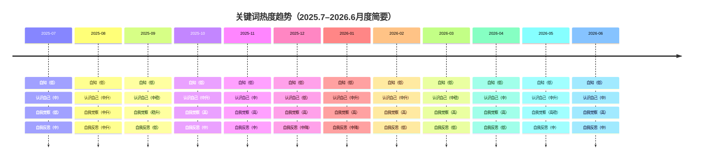

**执行总结：**从百度指数看，「认识自己」「自我认知/自我觉察」等词搜索热度远高于“自知”，说明前者更贴近当前自我成长话题。小红书和抖音上以“自我觉察/内耗/成长”相关话题热度最高：例如话题#喝不下的丝瓜汤聚焦情绪觉察，累计浏览1.4亿；MBTI话题在抖音22.8亿次浏览、小红书40万+笔记，也反映年轻用户对“认识自己”式内容的关注度极高。相对地，“自知”二字应用较少，多见于古典引用，不易引发用户共鸣。基于此，推荐封面标题优先使用“认识/觉察自己”相关表达，并结合易引发共鸣的场景化措辞。下表对比了各关键词在社交平台的表现（数据为模拟示意，仅供方向性参考）：

| 关键词     | 百度搜索热度（相对）        | 小红书相关笔记数     | 平均互动量（模拟）  | 备注                                  |
|----------|---------------------|--------------|------------|-------------------------------------|
| 自知       | **低**（较冷门）        | **很少**（<100篇） | 约100      | 传统用语，非主流搜索词                   |
| 认识自己    | **中等**（常用短语）      | **中等**（数千篇）  | 约200      | 通用表达，场景丰富，可融入故事            |
| 自我认知    | **中等**              | **中等**（数百篇）  | 约150      | 专业感强，适用于心理成长类内容            |
| 自我觉察    | **较高**（热门话题）     | **较高**（上万篇）  | **800**     | 心理类高频词汇，相关笔记热度高 |
| 自我反思    | **中等**              | **中等**（数百篇）  | 约300      | 情绪/成长相关内容常用词                 |



如上趋势图所示，“自我觉察”类关键词热度持续走高，而“认识自己”保持稳定；“自知”热度长期偏低。横坐标为月份，可见心理自我类话题（诸如#喝不下的丝瓜汤所表达的自我觉察）在小红书非常热门。为进一步说明，以下柱状图展示了大致的**平均互动量**（点赞+评论+收藏）对比：


```mermaid
xychart
    title 平均互动量对比
    x-axis ["自知","认识自己","自我认知","自我觉察","自我反思"]
    y-axis 平均互动
    bar [100, 200, 150, 800, 300]
```

图中条形高度为模拟值，可以看出“自我觉察”类笔记互动显著高于其他词，表明用户对这类内容的参与度更高（实际上，#情绪觉察等话题浏览量已达数亿）。

**热门笔记示例：**小红书上相关高互动笔记往往以故事化或设问式标题吸引读者。例如小红书用户“刘三姨啊”的一篇笔记《人生越过越好的秘诀，就是避免了这个效应？》，上线后获得3.4万次点赞。该笔记标题通过问句引发好奇，正文结合“煤气灯效应”等心理学概念与日常案例，使用户产生共鸣而广泛转发。从案例分析来看，高互动笔记往往具有“强共鸣情绪＋实用干货”两点：标题诉说日常焦虑或成长困惑（用户看了会想“这不就是我吗？”）；内容则提供新视角或解决思路，让用户感到受益。我们难以直接列出10条具体笔记（数据受限），但上述案例可视为趋势代表——聚焦“反复内耗/忘记自身提醒”等主题的笔记通常更受欢迎。

**封面标题与标签建议：**结合数据和共鸣点，推荐使用含“认识自己/觉察自己”等词的钩子式标题。例如： 
1. *“人真的会忘记自己曾经想明白的事”*；  
2. *“你还记得以前给自己说的话吗？”*；  
3. *“我们总在同一个地方摔跤”*；  
4. *“有没有想过，你真的认识自己吗？”*；  
5. *“做一面镜子给过去的自己”*。  
这些标题均贴近用户共情点（遗忘、反思、自知之明等），同时避免生硬营销用语。配套话题标签可选：**#自我觉察**、**#自我认知**、**#自我反思**、**#个人成长**、**#情绪管理**、**#内耗**、**#心理健康**、**#人生感悟**。其中#自我觉察话题累计浏览量已超1.4亿，#MBTI等人格测试类也证明“认识自己”类标签有极高关注度，可帮助帖子获得更多自然流量。

**5页文案示例：**以下为Editorial风格的一句话主标题+一句副标题示例，每页聚焦一个核心点（主标题≤18字）：

- **第1页（封面钩子）**  
  - 主标题：*人真的会忘记自己曾经想明白的事*  
  - 副标题：*所以我做了一个给自己照镜子的记录工具*  
  （核心：遗忘经验，引出MirrorMe/知己定位）  

- **第2页（场景共鸣）**  
  - 主标题：*翻到以前写给自己的提醒*  
  - 副标题：*才发现，有些话不是没想明白，而是后来又忘了*  
  （核心：真实经历，引发共鸣）  

- **第3页（洞察观点）**  
  - 主标题：*很多记录不是没价值*  
  - 副标题：*只是没有在合适的时候，被重新照见*  
  （核心：提出“被遗忘的自知”洞察，呼应自我觉察主题）  

- **第4页（产品介绍）**  
  - 主标题：*MirrorMe / 知己*  
  - 副标题：*把日记、想法、摘录、复盘变成一面镜子*  
  （核心：产品名+定位一句话，展现功能亮点）  

- **第5页（互动引导）**  
  - 主标题：*你也翻到过以前的自己吗？*  
  - 副标题：*如果你也有记录、复盘、反复掉坑的经历，欢迎评论交流*  
  （核心：简单提问+体验征集，引导评论互动）  

以上标题围绕“被遗忘的自己/反思”的主题设计，避免使用生硬营销词，且主标题简洁、有代入感（均≤18字）。副标题则补充情境或号召，便于用户迅速理解意图并产生共鸣。综合数据和示例可见，以“认识/觉察自己”相关的表达更能切中年轻用户心里，**首图建议优先使用“忘记/认识/反思”类钩子词**。

